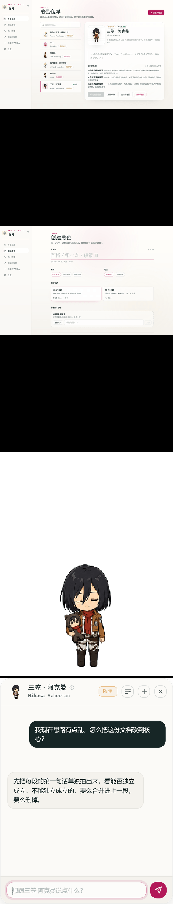

# 百灵 Bailin

> **桌面上的百变魂灵 —— 把你心目中的那个「他/她/它」装进桌面，常驻陪你 60 秒可造，随手可唤起。**

<p align="center">
  <!-- TODO(@you): 上线前在 assets/ 放一张 hero.png（推荐 1600×900，桌面 + 桌宠 + 聊天窗同框）；暂用 logo.png -->
  
</p>

<p align="center">
  <a href="#-30-秒体验">30 秒体验</a> ·
  <a href="#-它能为你做什么">它能为你做什么</a> ·
  <a href="#-为什么是受-xx-启发不是模仿">为什么是「受启发」</a> ·
  <a href="#%EF%B8%8F-免责声明">免责声明</a> ·
  <a href="#-开发者文档">开发者</a>
</p>

---

## ✨ 这是什么

你心目中那个**总能给你不一样答案**的人 —— 可能是某个企业家、某个学者、某个虚构作品里的角色、某个让你想到就觉得安心的存在 —— 把 ta「请」到你的桌面上，遇到事的时候随手唤一声，听 ta 怎么看这件事。

百灵 Bailin 做两件事：

1. **造一个 ta** — 输入名字，60 秒（快速模式）或 5–15 分钟（深度模式），蒸馏出 ta 的心智框架 + 表达方式 + 像素小形象。
2. **请 ta 上桌** — 像素桌宠常驻屏幕右下角，`Ctrl + Shift + P` 一键召唤聊天。

> 不是「让 AI 表演成 XX」，是「让 AI 用 XX 的视角看你的问题」。

---

## 🎯 它能为你做什么

### 场景一：「我现在卡住了」

> 你在写一份很重要的文档，思路乱了。你按 `Ctrl + Shift + P`，把"我想表达的核心其实是 …，但写出来感觉很啰嗦，要怎么砍？"扔给桌面上的张小龙。
>
> 他用他一贯的极简视角，告诉你"先把每段第一句话单独抽出来，看是否能独立成立"。

### 场景二：「这事我该怎么决定」

> 你在犹豫一个职业选择。你召唤芒格，问"这件事的反向思考是什么？"
>
> 他给你 3 个反向问题，每个都让你脊背发凉，最后你自己想清楚了答案。

### 场景三：「想跟某个角色说说话」

> 工作累了一天，你召唤一个你最喜欢的二次元角色，跟 ta 说几句不咸不淡的话。
>
> ta 不会"说教"，不会偏离人设，会以你熟悉的语气回应你。桌面瞬间不那么冷了。

---

## 🎬 30 秒体验

<p align="center">
  <!-- TODO(@you): 录一个 30 秒 GIF：从首启 → 选示例 → 桌宠上桌 → 唤起聊天，放到 assets/demo.gif -->
  
</p>

### 1. 首启配置，然后造一只

安装后走首启向导：免责声明 → 配置 API Key → 输入角色名 → 选身份与定位 → （可选）上传参考图 → 「快速创建」。

约 60 秒后，ta 就在你桌面上了。

<p align="center">
  
</p>

> 开发者可在 `apps/desktop/src/shared/starters.ts` 追加 `CharacterBundle` 作为内置 starter；开源版默认列表为空。

### 2. 随手唤起

`Ctrl + Shift + P` 或点击桌宠 → 聊天窗弹出在桌宠旁边，不抢工作焦点。`Esc` 收起，回到屏幕的安静状态。

<p align="center">
  
</p>

---

## 🌱 为什么是「受 XX 启发」，不是「模仿」

百灵不在 AI 里塞「XX 的常用台词」 —— 那样会让 AI 像个糟糕的演员，越聊越假。

百灵蒸馏的是**思维骨架**：

- **心智模型** —— ta 看世界用的几把尺子（如芒格的「反向思考」、费曼的「Cargo Cult」、张小龙的「用完即走」）
- **决策启发式** —— ta 在岔路口习惯用的判断方法
- **表达 DNA** —— ta 句子的节奏、用的标志性短语、回避的话题
- **内在张力** —— ta 自己的矛盾与未解之处

LLM 拿到这套骨架后，**用 ta 的角度看你的问题**，给出**那个特定视角下的回答**，而不是模仿 ta 演戏。

> 受 [女娲 Skill](https://github.com/alchaincyf/nuwa-skill) 的「造人术」启发，并把它产品化成你可以随手用的桌面伙伴。

---

## 🔒 你的数据，你的 Key，你的桌面

- **零订阅** — 自带 OpenAI / Anthropic / OhMyGPT 等任意兼容 API Key
- **完全本地** — 所有角色、对话、用户画像都存在你电脑上的 SQLite，不上报任何遥测
- **Key 加密** — 用 Windows DPAPI 系统级加密，离开本机即失效
- **一键清空** — 设置里随时清掉所有数据 + Key，干净退场

---

## ❤️ 致谢

百灵站在两个开源 skill 的肩膀上：

| Skill | 致谢的部分 | 链接 |
|---|---|---|
| **女娲 · 造人术 Skill** by 花叔 [@AlchainHust](https://github.com/alchaincyf) | 整个**人格蒸馏**的方法论 —— 「心智模型 + 决策启发式 + 表达 DNA」的结构化注入，以及深度模式的多 Agent 调研编排 | [alchaincyf/nuwa-skill](https://github.com/alchaincyf/nuwa-skill) |
| **hatch-pet · 桌宠像素孵化 SKILL** by OpenAI Skills | 桌宠的**像素形象生成**流水线 —— canonical 主立绘 + 9 个状态 strip + atlas 拼图的工程范式 | [openai/skills · hatch-pet](https://github.com/openai/skills/blob/main/skills/.curated/hatch-pet/SKILL.md) |

还要特别感谢：

- 像素美术参考了开源 chibi sprite 风格惯例（非具体作品照搬）

如果你觉得百灵有意思，**请去给上面两个上游项目点 star** —— 没有它们，就没有这只小桌宠。

---

## ⚖️ 免责声明

> **请在使用前完整阅读本节。继续使用本工具即视为你已阅读并同意以下条款。**

### 1. 关于本工具的性质

百灵 Bailin 是一个**完全本地运行**的开源工具。它本身不提供任何角色内容，**所有角色都由你（终端用户）自行输入、自行生成**。本工具：

- 仅承载技术能力（蒸馏、渲染、对话编排），**不预设、不分发**任何特定真人 / IP 角色素材
- 仅在你**自己的电脑、用你自己的 LLM API Key** 调用模型；作者**不接触**你的对话内容
- 所有生成结果均强制标注 **"受其启发，非本人 / 非官方 / 非授权"** 硬标识
- 角色形象采用**像素抽象化**处理（chibi / pixel art 比例），不构成原型外貌的精确复刻

### 2. 关于真实人物（在世名人 / 公众人物 / 任何自然人）

如果你创建的角色受到**任何真实人物**启发（无论你是否输入了真名），请理解：

- **中国大陆用户**：你的使用行为可能涉及《民法典》第 1018–1027 条对**肖像权 / 名誉权 / 隐私权**的规定。即使是像素化形象，若让公众明显可识别到特定个人，仍可能构成肖像使用
- **海外用户**：你需自行评估所在司法辖区的 **Right of Publicity / Personality Rights / Privacy Law** 等规定
- **共同准则**：
  - ❌ 不得让生成内容**伪装成 ta 的真实观点 / 声明 / 立场**
  - ❌ 不得用于**诽谤、攻击、煽动、性化、骚扰**任何特定个人
  - ❌ 不得**未经原型本人授权**用于任何商业、营销、宣传场景
  - ⚠️ **强烈建议**：仅对已**充分历史化**的人物（去世多年的历史人物）使用；对在世人士，仅作个人学习参考用途，不公开传播
- 涉及**未成年人**、**正处于法律事件中**的人物，请**立即停止**该角色的创建与使用

### 3. 关于虚构 / 二次元 / 影视游戏角色

绝大多数虚构角色（包括但不限于动漫、漫画、游戏、小说、影视、Vtuber 角色）受到多重权利保护：

- **中国大陆**：可能受《著作权法》《商标法》《反不正当竞争法》《角色商品化权》多重保护
- **日本**：判例确认了角色商品化权（キャラクター・マーチャンダイジング）
- **欧美**：受 Copyright + Trademark + Character Right 综合保护

因此，当你使用受 IP 保护的角色时：

- ✅ **可以**：仅供你**个人欣赏、学习、研究**的私人使用；不公开分享、不商业化
- ❌ **不可以**：
  - 分发包含他人 IP 角色卡 / 像素帧 / 对话记录的 `.bailin` 角色包
  - 在视频、直播、社交媒体等**公开渠道**中将该角色作为商品、营销元素、引流素材
  - 用于任何形式的**收费内容**（付费聊天、付费角色、Patreon 等）
- ⚠️ 如该 IP 持有方（出版社 / 动画公司 / 游戏厂商）明确表示**反对粉丝二创**，请**尊重其意愿**并不使用

### 4. 关于你上传的参考图

「创建角色」时上传的图片必须满足以下**至少一项**：

- 你**拥有版权**的原创图像（你自己画的、自己拍的）
- 处于**公共领域**（如著作权保护期已过的作品）
- 符合**合理使用 / 合理引用**范围的图像
- 你已获得权利人**明确授权**的图像

上传的图像在**本地处理**；当你启用了 Vision 模型时，图像会按你所配置的 LLM 服务商规则上传至其 API（请自行查阅该服务商的隐私政策）。

### 5. 关于内置示例角色（若提供）

若仓库或发行版附带内置示例角色，其基于**已充分进入公共讨论**的历史 / 公众人物，且：

- 使用**抽象化像素形象**，无任何对真人照片或官方艺术的精确复刻
- 标注「受其启发，非本人 / 非官方 / 非授权」
- 仅作**功能演示**，不作任何商业用途
- 如有原型本人 / 监护人 / 法务代表认为相关示例不合适，请联系下方下架渠道，我们将**立即响应**

当前开源版默认**不包含**内置示例（`STARTER_BUNDLES` 为空）；你可自行在 `apps/desktop/src/shared/starters.ts` 追加。

### 6. 关于本工具作者的责任范围

- 本工具以 **MIT License** 开源，作者按"现状"提供，**不提供任何明示或默示担保**
- 作者**不对**任何用户使用本工具产生的法律后果、经济损失、人身损害或其他争议承担责任
- 用户应**自行评估**在自己司法辖区下的使用合规性
- 如本工具在你所在国家 / 地区因法律 / 政策原因不能合规使用，请**立即停止使用**

### 7. 下架与争议处理（Takedown）

如果你是：

- 被复刻角色的**原型本人**或**法定监护人**
- **版权 / 商标 / 角色权所有人** 或其**经授权的法务代表**
- **经纪公司 / 出版方** 的官方代表

并希望对**仓库内置示例**或**任何公开传播的衍生作品**提出异议或下架请求，请通过以下任一方式联系：

- 📮 GitHub Issue：在本仓库 [issues](../../issues) 提交（标题前缀 `[Takedown]`）
- ✉️ Email：（_作者发布版本时请补充联系邮箱_）

请在请求中包含：

1. 你的**身份证明 / 授权证明**（律师函、版权登记、官方授权书等）
2. 具体的**异议对象**（哪个角色、哪个版本、哪个具体素材）
3. 你的**诉求**（删除示例、修改标识、加入禁止清单等）

我们承诺在收到**合理凭证**后 **7 个工作日内**响应。

---

## 🛠 开发者文档

<details>
<summary>👉 安装、构建、自定义角色协议、修改 sprite DSL — 点击展开</summary>

### 环境要求

- Windows 10 / 11（macOS / Linux 在 v0.1+ 路线图）
- Node.js ≥ 20.10
- pnpm 9（`corepack enable` 自动管理）

### 安装与构建

```bash
pnpm install         # 自动 rebuild better-sqlite3 + 下载 Electron
pnpm build           # 全产物构建（packages + main + preload + renderer）
pnpm dev             # dev 模式：vite + tsc watch + electron 一起启动
```

### 仓库结构

```
bailin/
├── apps/
│   └── desktop/                    # Electron 应用（main / preload / renderer）
├── packages/
│   ├── character-protocol/         # CharacterCard / AppearanceSpec / SpriteProgram schema
│   ├── sprite-runtime/             # DSL 渲染器 + 状态机 + guard 沙箱 + dsl-presets
│   ├── prompts/                    # 蒸馏 / 调研 / 外貌 / 对话 / hatch-pet prompt
│   └── pet-atlas-tools/            # hatch-pet atlas 裁帧 / 拼图 / 校验
├── apps/desktop/src/shared/starters.ts  # 可选内置 starter 列表（默认空）
├── assets/                         # README 用图与 logo
├── docs/
│   └── skills/                     # 与女娲 Skill 的关系说明
└── scripts/
    ├── verify/                     # verify-hatch-pet、verify-starters 等
    ├── debug/                      # 端到端调试脚本
    └── smoke/                      # 外部 provider 冒烟脚本
```
### 验证脚本

```bash
node scripts/verify/verify-hatch-pet.mjs       # atlas 裁帧 / 拼图 / schema
node scripts/verify/verify-sprite-builder.mjs  # sprite-builder + starter 兼容
node scripts/verify/verify-llm-multimodal.mjs  # LLM 多模态 adapter（需配置 Key）
node scripts/verify/verify-starters.mjs        # 内置角色 bundle 校验
```

**无障碍自动扫描**（可选，需 `pnpm dev` 已启动）：

```bash
cd apps/desktop
pnpm add -D puppeteer axe-core   # 首次需安装
node ./scripts/a11y-scan.mjs     # 扫 pet / chat / settings / bubble 四窗口
```

期望无 critical / serious violation。axe 扫不了焦点流转与屏幕阅读器朗读，UI 大改后仍需手测。

### 架构

- **桌面壳**：Electron（Windows 优先；透明置顶 Pet 窗 + 附着 Chat 窗 + Settings SPA）
- **主进程**：托盘 / 全局快捷键、LocalVault（SQLite）、LLMAdapter、BailinOrchestrator、CharacterRuntime、DPAPI Key 加密
- **渲染进程**：Pet Canvas + Web Worker 内跑 SpriteProgram；Chat / Settings 走 Vite + React
- **原则**：内核（协议 / 运行时 / 记忆）与 Electron 外壳分离；零云服务；LLM 输出在用户机执行须沙箱化

| 窗口 | 职责 |
| --- | --- |
| Pet | 透明无边框、可拖拽；像素 alpha 区域外鼠标穿透 |
| Chat | 跟随桌宠、Esc 关闭、流式对话 |
| Settings | 首启向导、Key、角色仓库、记忆、外观 |

### 角色协议

一个角色 = **`CharacterBundle = { card, sprite, runtime }`**（见 `packages/character-protocol`）。

| 部分 | 作用 | 实现包 |
| --- | --- | --- |
| **CharacterCard** | 人格：心智模型、决策启发式、表达 DNA、价值观、诚实边界 | `character-protocol` |
| **SpriteProgram** | 形象：调色板 + 部件 + 动画 + 状态机（DSL JSON；guard 白名单 AST） | `character-protocol` + `sprite-runtime` |
| **RuntimeConfig** | 温度、上下文长度等运行参数 | `character-protocol` |

**CharacterCard 要点**（对应 [女娲 Skill](https://github.com/alchaincyf/nuwa-skill) 结构化版本）：

- `meta`：名称、来源类型（公众人物 / 虚构 / 原创）、实用线 vs 情感线、强制免责文案
- `mentalModels[]`（≥2）、`heuristics[]`、`expressionDNA`、`values`、`honestyBoundary`
- 字段变更须升 `schemaVersion` 并写迁移器

**SpriteProgram 要点**：

- 默认 **DSL 模式**（纯 JSON，不存图片）；`mode: 'dsl' | 'js-sandbox'`
- 状态机驱动 idle / walk / talk / think / click 等；`guard` 表达式在 Worker 内白名单求值
- 共用动画预设见 `sprite-runtime` 的 `dsl-presets`；用户新建走 `sprite-builder` + hatch-pet atlas 流水线

提示词模板（快速/深度造人、外貌调研、system prompt 组装）在 `packages/prompts/`。

### 核心流程

| # | 流程 | 入口 → 产出 |
| --- | --- | --- |
| 1 | 首启 | 免责声明 → 配置 Key → 选示例或造人 → 桌宠上桌 |
| 2 | 造人 | 设置 / 向导 → BailinOrchestrator（快速 ~60s / 深度 5–15min）→ CharacterBundle 入库 |
| 3 | 唤起聊天 | `Ctrl+Shift+P` 或点击桌宠 → CharacterRuntime + LLM 流式回复 |
| 4 | 记忆 | 设置 → 用户画像：自动学习事实，可编辑 / 清空（本地 SQLite） |
| 5 | 切换 / 删除 | 托盘菜单或角色仓库 → 更换激活角色或删除 CharacterBundle |

失败兜底：造人不合格时回退「骨架卡」（仍可上桌，UI 灰色标记）。

### MVP 边界

**范围内**：快速造人、DSL 桌宠、桌面常驻、唤起聊天、轻量用户画像、Windows、自带 API Key。

**范围外（路线图）**：关系养成 / 好感度、主动推送、角色市场与云同步、多角色同时在桌、macOS / Linux（v0.1+ 规划）。

### 关键设计

- **协议优先** —— `character-protocol` 定义角色长什么样、怎么思考、怎么动；字段变更须升 `schemaVersion` + 写迁移器
- **沙箱大于自由** —— SpriteProgram 在 Web Worker 中执行，guard 表达式走白名单 AST 校验
- **内置 vs 生成** —— 可选 starter 在 `apps/desktop/src/shared/starters.ts`；用户新建走 `sprite-builder` + `dsl-presets`
- **Vision-first 外貌** —— 参考图 → vision 读图 → JSON 结构化 → vision 自检 → 程序化 sprite

### 无障碍验证

发版或合并重大 UI 改动前，至少确认：

| 区域 | 必测要点 |
| --- | --- |
| **Pet** | Tab 聚焦 + 焦点环；Enter 唤起聊天；Shift+F10 菜单键盘导航；Esc 后焦点回到桌宠 |
| **Chat** | 空发送有提示；History panel focus trap；popover 内点击不意外关闭；复制失败有 toast |
| **Settings** | OptionGroup / BlSelect combobox 键盘可用；checkbox 点 label 可切换 |
| **Bubble** | aria-live 朗读；键盘聚焦时 dismiss 计时暂停 |
| **全局** | 断网启动不白屏；light/dark 四窗口无穿帮 |

可选：Windows 安装 [NVDA](https://www.nvaccess.org/) 做屏幕阅读器手测。共享 a11y 工具在 `apps/desktop/src/renderer/shared/`（`useFocusTrap`、`useReducedMotion`、`OptionGroup` 等）。

### 数据目录

```
%APPDATA%/Bailin/
├── vault.db              # 角色 / 设置 / 会话 / 用户画像
└── research/<charId>/    # 深度蒸馏调研 Markdown 存档
```

完全卸载：删除 `%APPDATA%/Bailin/` 文件夹。

### 更多文档

- [与女娲 Skill 的关系](docs/skills/README.md)

</details>

---

## 🗺 路线图

当前 **v0.x** 聚焦 **造人 → 上桌 → 唤起聊天** 闭环。

| 阶段 | 主题 | 代表能力 |
| --- | --- | --- |
| **v0.x**（现在） | MVP 闭环 | 快速造人、DSL 桌宠、本地记忆、6 示例、Windows |
| **v1.0** | 体验提升 | 深度造人、形象丰富化、对话 UX、严格模式、自动更新（opt-in） |
| **v1.1** | 多角色 | 多只桌宠同时在桌、角色切换优化 |
| **v1.2** | 关系养成 | 长期记忆、好感度 / 关系阶段 |
| **v1.3** | 主动陪伴 | 主动气泡、安静时段、场景化提醒 |
| **v2.0+** | 平台化 | `.bailin` 角色包（仅原创 / 公域）、多模态 |
| **v3.0+** | 跨端 | macOS / Linux、移动端伴侣 |

近期公开目标：

- 🌙 多角色同桌（你的桌面「董事会」）
- 💞 关系养成（ta 慢慢知道你是谁、在做什么）
- 🎴 角色市场（`.bailin` 角色包分发，但**只针对原创 / 公共领域角色**）
- 🍎 macOS / Linux 支持
- 📱 移动端伴侣 App（先看看再说）

---

## 🤝 贡献

仓库处于早期 v0.0.1 阶段，欢迎以下方向的贡献：

- 🎨 像素 sprite 风格扩展 / 调色板
- 🧠 新的 perspective skill（**仅原创人物 / 公共领域人物**）
- 🐛 Bug fix（请附复现步骤 + 系统环境）
- 📖 文档 / 翻译

请遵守 [免责声明](#%EF%B8%8F-免责声明) 的边界；**含他人 IP 角色素材的 PR 一律不予合并**。

---

## License

**代码** —— [MIT License](LICENSE)

**用户生成的角色卡 / 形象 / 对话内容** —— 由用户**自行承担**版权 / 肖像权 / 名誉权等法律合规责任，**不在本 License 覆盖范围内**。详见 [免责声明](#%EF%B8%8F-免责声明)。

---

<p align="center">
  <sub>桌面上的百变魂灵 · Made with care · 不收一分订阅，只想让你想到 ta 时随手能找到 ta</sub>
</p>
