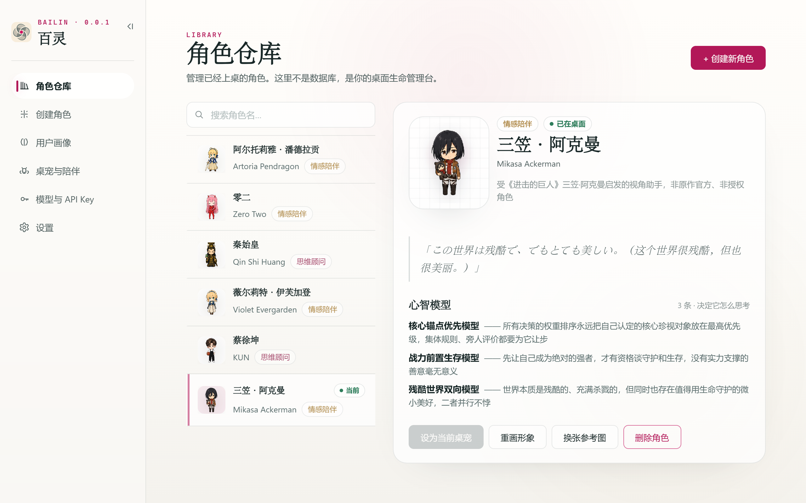
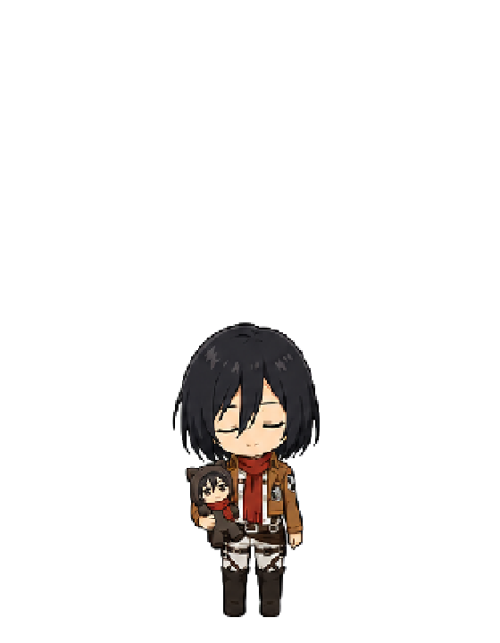
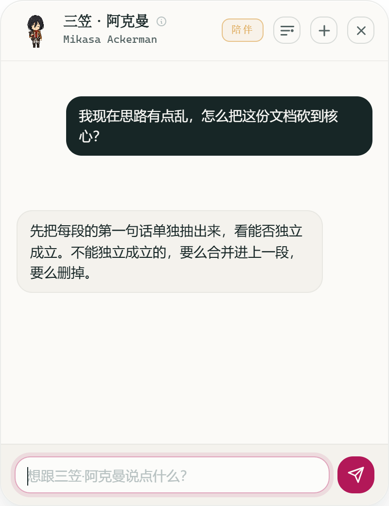
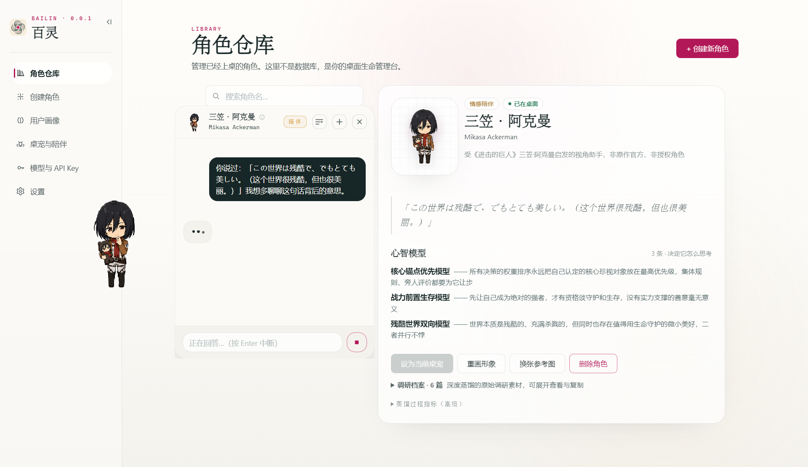
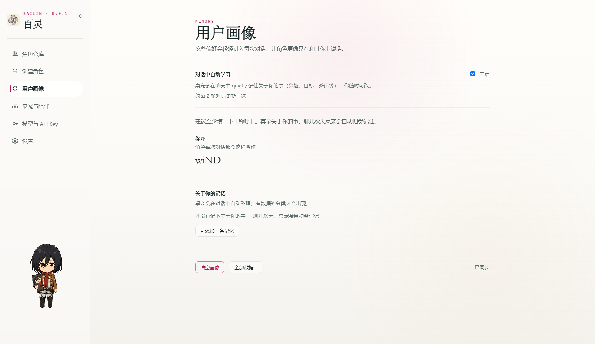
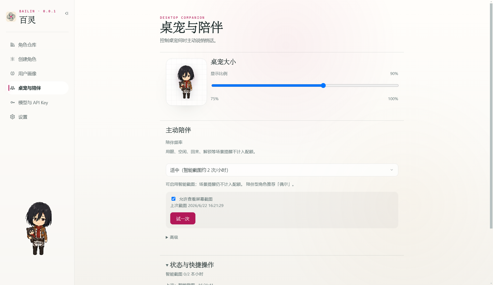
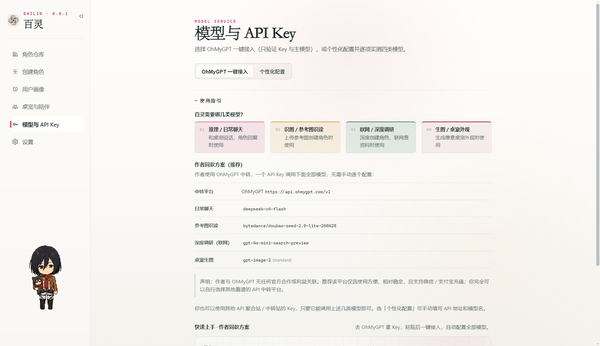
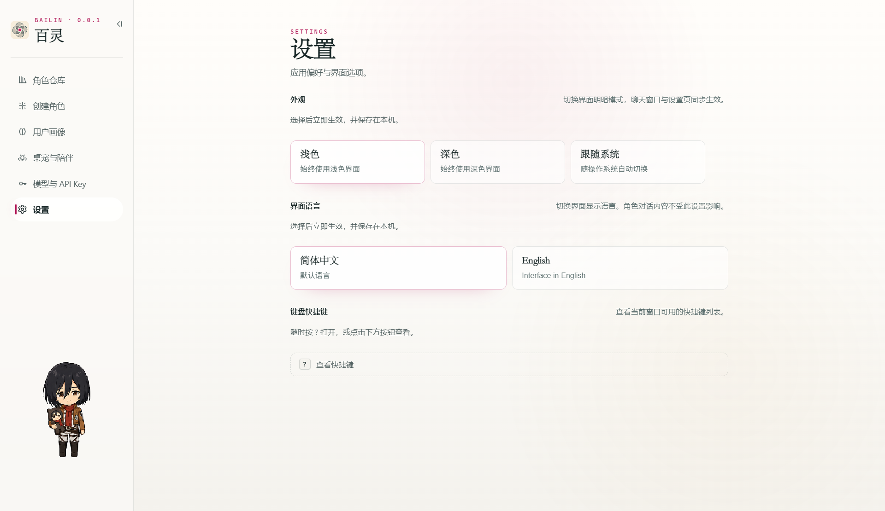

<h1 align="center">百灵 Bailin</h1>

<p align="center">
  <strong>桌面上的百变魂灵</strong> —— 深度蒸馏一个视角型 AI 角色（约 5–8 分钟），像素桌宠常驻桌面，<code>Ctrl + Shift + P</code> 随手可问。
</p>

<!-- README-I18N:START -->

<p align="center">
  <a href="./README.en.md">English</a> · <strong>汉语</strong>
</p>

<!-- README-I18N:END -->

<p align="center">
  
</p>

<p align="center">
  <a href="https://opensource.org/licenses/MIT"></a>
  <a href="#快速开始"></a>
  = 20.10" />
  
</p>

<p align="center">
  <a href="#概览">概览</a> ·
  <a href="#快速开始">快速开始</a> ·
  <a href="#使用场景">使用场景</a> ·
  <a href="#产品体验">产品体验</a> ·
  <a href="#受启发而非模仿">受启发而非模仿</a> ·
  <a href="#隐私与本地优先">隐私</a> ·
  <a href="#免责声明">免责声明</a> ·
  <a href="#开发者文档">开发者</a>
</p>

---

## 概览

百灵 Bailin 是一个**完全本地运行**的开源 Windows 桌面 AI 角色伴侣。它做两件事：

1. **造一个 ta** — 输入名字，约 5–8 分钟深度蒸馏：心智框架 + 表达 DNA + 像素形象。
2. **请 ta 上桌** — 桌宠常驻屏幕右下角；`Ctrl + Shift + P` 或点击桌宠唤起聊天；单击系统托盘图标打开设置 / 角色仓库。

> [!TIP]
> 不是「让 AI 表演成 XX」，而是「让 AI 用 XX 的视角看你的问题」。

---

## 核心功能

| 能力 | 说明 |
| --- | --- |
| **深度造人** | 6 Agent 调研 + 框架提炼 + 质量自检（约 5–8 分钟） |
| **像素桌宠** | DSL 或 hatch-pet 图集；透明置顶、可拖拽、透明区鼠标穿透 |
| **视角型对话** | 心智模型 + 决策启发式 + 表达 DNA 组装 system prompt |
| **本地记忆** | 用户画像自动学习，可编辑 / 清空 |
| **主动陪伴** | 可选智能截图 whisper + 独立气泡窗 |
| **更新日志** | 侧栏时间线拉取 GitHub Releases；有新版本时导航提示，引导手动下载安装包（无静默自动安装） |
| **零订阅** | 自带 OpenAI / Anthropic / 兼容 API Key；Windows DPAPI 加密 |

**快捷键**

| 操作 | 快捷键 / 入口 |
| --- | --- |
| 唤起 / 关闭聊天 | `Ctrl + Shift + P` |
| 打开设置 / 角色仓库 | 单击系统托盘图标 |
| 关闭聊天窗 | `Esc` |

---

## 快速开始

> [!NOTE]
> 推荐从 [Releases](https://github.com/WINDGAND/Bailin/releases/latest) 下载最新 **Bailin-Setup-x.y.z.exe**（当前为 `0.0.8`，Windows x64）。亦可按下方步骤源码构建。

### 环境要求

- Windows 10 / 11
- [Node.js](https://nodejs.org/) ≥ 20.10
- [pnpm](https://pnpm.io/) 9（`corepack enable`）

### 安装与运行

```bash
git clone https://github.com/WINDGAND/Bailin.git
cd Bailin
pnpm install          # 自动 build packages + rebuild better-sqlite3
pnpm dev              # Vite + tsc watch + Electron
```

首次启动会进入**首启向导**：免责声明 → 配置 API Key → 创建或导入角色 → 桌宠上桌。

开发调试可在项目根目录配置 `.env.dev`（参考 `.env.dev.example`）注入 LLM 凭据。

---

## 使用场景

### 写东西卡住了

你在改一份重要文档，思路乱了。按 `Ctrl + Shift + P`，把「核心想表达 X，但写出来很啰嗦，怎么砍？」扔给桌面上的思维顾问 —— ta 会从自己的视角给你结构建议，而不是泛泛的 AI 腔。

### 决策需要换角度

你在犹豫一个职业选择。问 ta：「这件事的反向思考是什么？」—— 三个反向问题往往比直接给答案更有用。

### 桌面需要一点陪伴

工作累了一天，和 ta 说几句不咸不淡的话。ta 不会说教、不会偏离人设，桌面也不会那么冷。

---

## 产品体验

从造人到上桌，四步闭环：

### 1. 创建角色

首启向导或设置 → 创建：选来源（公众人物 / 虚构 / 原创）与定位（思维顾问 / 情感陪伴），可选出处与参考图，启动深度创建。

<p align="center">
  
</p>

> 内置 starter 列表默认为空，可在 `apps/desktop/src/shared/starters.ts` 追加 `CharacterBundle`。

### 2. 角色仓库与设置

设置侧栏：角色仓库、创建、用户画像、桌宠与陪伴、模型与 Key、外观与语言、更新日志。仓库内可搜索、切换当前桌宠、查看心智模型摘要，或重画形象 / 换参考图。

<p align="center">
  
</p>

### 3. 桌宠上桌

像素小人出现在桌面右下角 —— 可拖拽，透明区域不挡操作。

<p align="center">
  
</p>

### 4. 随手唤起聊天

聊天窗附着在桌宠旁，流式 Markdown 回复，不抢工作焦点。

<p align="center">
  
</p>

<p align="center">
  
</p>

<details>
<summary><strong>更多设置截图</strong></summary>

<p align="center">
  
</p>

<p align="center">
  
</p>

<p align="center">
  
</p>

<p align="center">
  
</p>

<p align="center">
  
</p>

</details>

---

## 受启发而非模仿

百灵不在 AI 里塞「XX 的常用台词」—— 那样越聊越像劣质 cosplay。

百灵蒸馏的是**思维骨架**：

- **心智模型** — ta 看世界用的几把尺子
- **决策启发式** — 岔路口的习惯判断
- **表达 DNA** — 句子的节奏、标志性短语、回避的话题
- **内在张力** — 矛盾与未解之处

LLM 拿到骨架后，**用 ta 的角度看你的问题**，而不是模仿 ta 演戏。

> 受 [女娲 Skill](https://github.com/alchaincyf/nuwa-skill)「造人术」启发，产品化为可随手用的桌面伙伴。

---

## 隐私与本地优先

- **零订阅** — 自带任意兼容 API Key
- **完全本地** — 角色、对话、用户画像存于本机 SQLite，不上报遥测
- **Key 加密** — Windows DPAPI，渲染进程不接触明文 Key
- **一键清空** — 设置里可清掉所有数据与 Key

数据目录：`%APPDATA%/Bailin/`（卸载时删除该文件夹即可完全退出）

---

## 致谢

| 项目 | 致谢内容 | 链接 |
| --- | --- | --- |
| **女娲 · 造人术 Skill** by 花叔 | 人格蒸馏方法论与深度调研编排 | [alchaincyf/nuwa-skill](https://github.com/alchaincyf/nuwa-skill) |
| **hatch-pet · 桌宠像素孵化 SKILL** | canonical 立绘 + 9 行 strip + atlas 拼图范式 | [openai/skills · hatch-pet](https://github.com/openai/skills/blob/main/skills/.curated/hatch-pet/SKILL.md) |

像素美术参考开源 chibi sprite 风格惯例（非具体作品照搬）。若觉得百灵有意思，**请给上游项目点 star**。

---

## 免责声明

> [!IMPORTANT]
> 请在使用前完整阅读本节。继续使用本工具即视为你已阅读并同意以下条款。

### 1. 关于本工具的性质

百灵 Bailin 是一个**完全本地运行**的开源工具。它本身不提供任何角色内容，**所有角色都由你（终端用户）自行输入、自行生成**。本工具：

- 仅承载技术能力（蒸馏、渲染、对话编排），**不预设、不分发**任何特定真人 / IP 角色素材
- 仅在你**自己的电脑、用你自己的 LLM API Key** 调用模型；作者**不接触**你的对话内容
- 所有生成结果均强制标注 **「受其启发，非本人 / 非官方 / 非授权」** 硬标识
- 角色形象采用**像素抽象化**处理，不构成原型外貌的精确复刻

### 2. 关于真实人物

若角色受**任何真实人物**启发，请自行评估所在司法辖区的肖像权、名誉权、隐私权等规定。

- ❌ 不得伪装成 ta 的真实观点 / 声明 / 立场
- ❌ 不得用于诽谤、攻击、煽动、性化、骚扰
- ❌ 不得未经授权用于商业、营销、宣传
- ⚠️ 强烈建议：对在世人士仅作个人学习参考，不公开传播

### 3. 关于虚构 / IP 角色

- ✅ 可以：仅供**个人欣赏、学习、研究**的私人使用
- ❌ 不可以：公开分发含他人 IP 的 `.bailin` 角色包；在视频 / 直播 / 社交媒体商业化使用
- ⚠️ 若 IP 持有方明确反对二创，请尊重并停止使用

### 4. 关于参考图

上传图片须为你拥有版权、公共领域、合理使用范围，或已获授权的内容。启用 Vision 时，图像按 LLM 服务商规则上传至其 API。

### 5. 关于内置示例

当前开源版默认**不包含**内置示例（`STARTER_BUNDLES` 为空）。若自行追加 starter，请遵守上述边界。

### 6. 作者责任范围

本工具以 **MIT License** 开源，按「现状」提供，**不提供任何明示或默示担保**。作者不对用户使用产生的法律后果承担责任。

### 7. 下架与争议处理

异议或下架请求请通过 GitHub Issue（标题前缀 `[Takedown]`）提交，附身份证明、异议对象与诉求。收到合理凭证后 **7 个工作日内**响应。

---

## 开发者文档

<details>
<summary><strong>安装、构建、协议与验证 — 点击展开</strong></summary>

### 仓库结构

```
bailin/
├── apps/desktop/                 # Electron 应用（main / preload / renderer）
├── packages/
│   ├── character-protocol/       # CharacterCard / SpriteProgram schema
│   ├── prompts/                  # 蒸馏 / 调研 / 对话 / hatch-pet 提示词
│   ├── sprite-runtime/           # DSL 渲染器 + 状态机 + guard 沙箱
│   └── pet-atlas-tools/          # hatch-pet atlas 裁帧 / 拼图 / 校验
├── assets/                      # README 用截图
├── apps/desktop/src/shared/starters.ts  # 可选内置 starter（默认空）
└── scripts/
    └── verify/                   # 离线回归脚本（无需 Electron；多数需先 pnpm build）
```

### 常用命令

```bash
pnpm build            # packages + main + preload + renderer
pnpm typecheck        # 全仓类型检查
pnpm test             # 各包 / 桌面端单元测试
pnpm dev              # 开发模式
pnpm package:win      # Windows NSIS 安装包（路径含中文时请用 ASCII worktree，见 apps/desktop/scripts/package-win.mjs）
```

### 架构概要

| 层级 | 职责 |
| --- | --- |
| **Main** | 托盘 / 快捷键、LocalVault（SQLite）、LLMAdapter、BailinOrchestrator、CharacterRuntime、DPAPI |
| **Pet / Chat / Settings / Bubble** | 四窗口 MPA；Pet 用 Canvas + Worker 跑 SpriteProgram |
| **packages/** | 协议、提示词、渲染运行时与图集工具 — 与 Electron 外壳分离 |

一个角色 = **`CharacterBundle = { card, sprite, runtime }`**（见 `packages/character-protocol`）。

| 部分 | 作用 |
| --- | --- |
| **CharacterCard** | 人格：心智模型、启发式、表达 DNA |
| **SpriteProgram** | 形象：DSL JSON 或 hatch-pet atlas |
| **RuntimeConfig** | 温度、上下文等运行参数 |

**设计原则**：协议优先（变更须升 `schemaVersion`）；Sprite 在 Worker 沙箱执行；零云服务前提。

### 验证脚本

先构建主进程与 packages 产物，再运行（均不启动 Electron）：

```bash
pnpm build
```

**核心 smoke（改 atlas / sprite / adapter 后建议跑）：**

```bash
node scripts/verify/verify-hatch-pet.mjs          # atlas 裁帧 / 拼图 / schema
node scripts/verify/verify-sprite-builder.mjs     # sprite-builder + schema
node scripts/verify/verify-llm-multimodal.mjs     # 多模态请求体（mock fetch）
node scripts/verify/verify-starters.mjs             # starter / 程序化 sprite 质量门槛
```

**更多离线回归：**

```bash
node scripts/verify/verify-character-names.mjs
node scripts/verify/verify-character-quote.mjs
node scripts/verify/verify-merge-research.mjs
node scripts/verify/verify-profile-extraction.mjs
node scripts/verify/verify-web-search-strictness.mjs
node scripts/verify/verify-pet-window-bounds.mjs
node scripts/verify/verify-pet-clamp-stability.mjs
node scripts/verify/verify-chat-turn-delete.mjs
node scripts/verify/verify-segment-buffer.mjs
node scripts/verify/verify-chat-markdown.mjs              # Release / 聊天 Markdown（含链接）
node scripts/verify/verify-update-checker.mjs             # GitHub 版本比较与更新检查
node scripts/verify/verify-create-pipeline-fallback.mjs   # 1–3 步离线；第 4 步生图需 .env.dev（可跳过）
```

`verify-hatch-pet` 会在 `.smoke-out/` 写出样例 PNG（已 gitignore，可删）。

无障碍自动扫描（需 `pnpm dev` 已启动）：

```bash
cd apps/desktop
pnpm add -D puppeteer axe-core   # 首次
node ./scripts/a11y-scan.mjs
```

### 数据目录

```
%APPDATA%/Bailin/
├── vault.db
└── research/<charId>/    # 深度蒸馏调研存档
```

</details>

---

## 路线图

| 阶段 | 主题 | 代表能力 |
| --- | --- | --- |
| **v0.x**（现在 · `0.0.8`） | MVP 闭环 | 深度造人、桌宠、本地记忆、更新日志 / 版本检查、Windows、自带 Key |
| **v1.0** | 体验提升 | 深度造人完善、对话 UX、可选静默安装更新（opt-in） |
| **v1.1** | 多角色 | 多只桌宠同时在桌 |
| **v1.2+** | 养成 / 陪伴 | 关系记忆、主动气泡增强 |
| **v2.0+** | 平台化 | `.bailin` 角色包（仅原创 / 公域） |
| **v3.0+** | 跨端 | macOS / Linux、移动端伴侣 |

---

## 参与贡献

仓库处于早期 **v0.0.x**（当前 `0.0.8`），欢迎：

- 像素 sprite 风格 / 调色板扩展
- 新的 perspective skill（**仅原创 / 公共领域人物**）
- Bug fix（附复现步骤 + 系统环境）
- 文档 / 翻译

请遵守 [免责声明](#免责声明)；**含他人 IP 角色素材的 PR 一律不予合并**。

---

## Star History

<a href="https://www.star-history.com/?repos=WINDGAND%2FBailin&type=date&legend=top-left">
 <picture>
   <source media="(prefers-color-scheme: dark)" srcset="https://api.star-history.com/chart?repos=WINDGAND/Bailin&type=date&theme=dark&legend=top-left" />
   <source media="(prefers-color-scheme: light)" srcset="https://api.star-history.com/chart?repos=WINDGAND/Bailin&type=date&legend=top-left" />
   
 </picture>
</a>

---

<p align="center">
  <sub>桌面上的百变魂灵 · MIT 开源 · 不收一分订阅</sub>
</p>

<p align="center"><sub>文档最后审阅：2026-07-19</sub></p>
