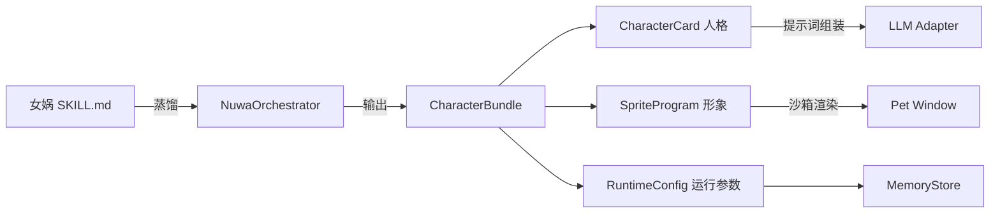
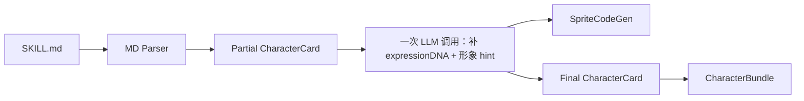

# 百灵 Bailin · 角色与渲染协议（CHARACTER-PROTOCOL v0.1）

> 配套：[PRD.md](PRD.md) §9 / [TECH-ROUTE.md](TECH-ROUTE.md) §6-§8
> 目的：定义"一个角色"在系统中的标准化形式 —— 人格、形象、运行时配置，并规定与女娲 Skill 之间的转换协议

---

## 1. 总览



**核心抽象**：一个角色 = `CharacterBundle = { card, sprite, runtime }`。

- `card` 解决"它怎么想 / 怎么说"
- `sprite` 解决"它长什么样 / 怎么动"
- `runtime` 解决"它在系统里以什么参数运行"

三者解耦：换形象不影响人格；换人格不影响形象；换运行参数（如温度、上下文长度）不影响前两者。

---

## 2. CharacterCard（人格协议）

### 2.1 设计原则

- **直接对应女娲 SKILL.md 的结构化版本**，方便从已有 Skill 一键导入
- 字段命名贴近 SKILL 模板，但全部 JSON 可序列化
- 区分"必填（生成质量底线）"与"可选（用于增强）"
- 不混入运行时状态（聊天历史等）

### 2.2 Schema（v0.1）

```ts
type CharacterId = string; // ULID

interface CharacterCard {
  schemaVersion: '0.1';
  id: CharacterId;
  createdAt: number;
  updatedAt: number;

  // === 元信息 ===
  meta: {
    name: string;                       // 显示名（用户看到的）
    sourceName?: string;                // 被启发的真实人物 / 角色名
    sourceType: 'public-figure' | 'fictional' | 'original'; // 来源类型
    track: 'utility' | 'companion';     // 实用线 vs 情感线
    quoteOneLiner?: string;             // 最能代表此角色的一句话
    avatarHint?: string;                // 视觉气质摘要（给 sprite gen 用）
    disclaimer: string;                 // 强制：受 XX 启发，非本人 / 非官方 / 非授权
  };

  // === 角色扮演规则（直接套女娲模板）===
  roleplay: {
    firstPersonOnly: true;              // 永远用"我"
    disclaimerOnce: true;               // 仅首次激活说一次免责
    exitTriggers: string[];             // "退出"、"切回正常"...
    refusalStyle?: string;              // 它会怎样有性格地拒绝
  };

  // === 身份卡 ===
  identity: {
    selfIntro: string;                  // 50 字以内第一人称自我介绍
    origin: string;                     // 关键背景
    currentDoing?: string;              // 最近动态（活人）/ 设定时的状态（虚构）
  };

  // === 核心心智模型（3-5 个，MVP 限制）===
  mentalModels: Array<{
    id: string;
    name: string;
    oneLiner: string;
    evidence: string[];                 // 2+ 来源 / 设定依据
    appliesTo: string[];                // 适用于哪些问题类型
    limits: string;                     // 失效条件
  }>;

  // === 决策启发式（5-8 条）===
  heuristics: Array<{
    id: string;
    rule: string;                       // 如「先做减法，再做加法」
    scenario: string;
    example?: string;
  }>;

  // === 表达 DNA ===
  expressionDNA: {
    sentencePattern: string;            // 长短句偏好
    vocabulary: {
      frequent: string[];               // 高频词
      signature: string[];              // 专属术语
      forbidden: string[];              // 禁忌词
    };
    rhythm: string;                     // 先结论 / 先铺垫 / 转折方式
    humor: string;                      // 讽刺 / 自嘲 / 冷 / 无
    certainty: 'cautious' | 'assertive' | 'mixed';
    citationHabits?: string;            // 爱引谁
  };

  // === 价值观与反模式 ===
  values: {
    pursue: string[];                   // 追求的
    reject: string[];                   // 拒绝的
    tensions?: string[];                // 内在矛盾（深度来源）
  };

  // === 时间线（精简）===
  timeline?: Array<{
    when: string;                       // 自由文本，可"约 1990 年代初"
    event: string;
    impactOnThinking?: string;
  }>;

  // === 安全声音（可选）===
  safetyVoice?: {
    refusalTemplates: string[];         // 角色化拒绝模板
    deescalationStyle: string;          // 缓和话术风格
  };

  // === 诚实边界 ===
  honestyBoundary: {
    notes: string[];                    // 已知局限
    informationCutoff?: string;         // YYYY-MM
    isHighInformationRichness: boolean; // 信息是否充足
  };

  // === 来源（可选，记录用于调试和透明度）===
  sources?: {
    primary: string[];
    secondary: string[];
    keyQuotes?: string[];
  };
}
```

### 2.3 与女娲 SKILL.md 的字段映射

| 女娲 SKILL.md 段落 | 对应 CharacterCard 字段 |
| --- | --- |
| frontmatter description / name | `meta.name` + `meta.sourceName` |
| 顶部引言 | `meta.quoteOneLiner` |
| 角色扮演规则 | `roleplay.*` |
| 身份卡 | `identity.*` |
| 核心心智模型 | `mentalModels[]`（取 top 3-5） |
| 决策启发式 | `heuristics[]`（取 top 5-8） |
| 表达 DNA | `expressionDNA` |
| 价值观与反模式 | `values` |
| 人物时间线 | `timeline` |
| 诚实边界 | `honestyBoundary` |
| 调研来源 | `sources` |
| 智识谱系 | （MVP 不入卡，存入 sources 备注） |
| 回答工作流 Agentic Protocol | （MVP 不入卡，由 Runtime 通用化处理） |

### 2.4 字段必填校验（生成验收线）

| 字段 | 缺失处理 |
| --- | --- |
| `meta.name` / `meta.disclaimer` | **失败**：整张卡作废，重试或退回骨架卡 |
| `mentalModels` 长度 < 2 | **失败**：要求 LLM 至少补到 2 个 |
| `expressionDNA.vocabulary.signature` 空 | **降级**：标记 `isHighInformationRichness = false` |
| `identity.selfIntro` 空 | **降级**：自动用 `${name} 的视角助手` 占位 |
| 任意字段超长（> 800 字） | **截断**并记录 warning |

### 2.5 骨架卡（造人失败兜底）

当 LLM 两次输出都不合格时，回退到一张"骨架卡"，包含：

- `meta.name` + `meta.sourceName`
- 1 个通用心智模型："多角度思考"
- 1 条启发式："先听清问题再回答"
- 中性表达 DNA
- `honestyBoundary.isHighInformationRichness = false`
- 显眼标注："这只角色还没准备好，请提供更多素材或换个模型再试"
- 仍然可以放上桌面 / 唤起聊天，但 UI 用"灰色徽章"标记

---

## 3. SpriteProgram（形象协议）

### 3.1 设计原则

- **代码即形象，不存图片**：用调色板 + 部件 + 关键帧 + 状态机描述
- **DSL 优先，JS 兜底**：默认产物是纯 JSON（DSL 模式）；只在 DSL 表达力不够时启用受限 JS 子集
- 沙箱第一：渲染器只接 `state / tick / cursor` 输入，输出 ImageBitmap
- 默认尺寸 96×96 像素 + 4 倍放大显示（保留像素感）

### 3.2 顶层 Schema

```ts
interface SpriteProgram {
  schemaVersion: '0.1';
  mode: 'dsl' | 'js-sandbox';
  // 通用元数据
  size: { width: number; height: number };      // 像素尺寸（不含放大）
  displayScale: 1 | 2 | 3 | 4;                  // 显示倍数（默认 4）
  palette: Array<{ name: string; hex: string }>; // 调色板（最多 16 色）

  // === DSL 模式 ===
  dsl?: SpriteDSL;

  // === JS 沙箱模式（v1.x 才默认开启） ===
  js?: {
    source: string;                              // 受限 JS 子集源码
    entryFn: 'renderFrame';
  };
}
```

### 3.3 DSL 模式详细 Schema

```ts
interface SpriteDSL {
  // 角色的"骨架"：部件 + 锚点
  parts: Array<{
    id: string;                                  // 'body', 'head', 'eyes', 'mouth', 'hair', 'accessory-1'
    paletteIndex?: number;                       // 引用调色板
    pixels?: string[];                           // 像素矩阵，每行用 ' ' / 'A'-'P' 表示透明 / 调色板索引
    // 或用基本几何（更紧凑）：
    shapes?: Array<{
      type: 'rect' | 'circle' | 'pixel' | 'line';
      x: number; y: number; w?: number; h?: number; r?: number;
      paletteIndex: number;
    }>;
    anchor?: { x: number; y: number };
    z: number;                                   // 渲染层级
  }>;

  // 关键帧（按动作分组）
  animations: Record<AnimationName, {
    fps: number;
    loop: boolean;
    frames: Array<{
      duration: number;                           // 帧持续 tick 数
      transforms: Array<{
        partId: string;
        dx?: number; dy?: number;
        rotate?: number;                          // 度
        scale?: number;
        visible?: boolean;
        paletteSwap?: number;                     // 临时换色
      }>;
    }>;
  }>;

  // 状态机：状态 → 当前动画 + 跳转规则
  stateMachine: {
    initial: SpriteState;
    states: Record<SpriteState, {
      animation: AnimationName;
      transitions: Array<{
        on: SpriteEvent;
        to: SpriteState;
        guard?: string;                            // 受限表达式，如 'tick > 500'
      }>;
    }>;
  };
}

type AnimationName =
  | 'idle'
  | 'idle-blink'
  | 'walk-left' | 'walk-right'
  | 'click-reaction'
  | 'drag'
  | 'talk'
  | 'think'
  | 'sleep';

type SpriteState =
  | 'idle' | 'walk' | 'click' | 'drag' | 'talk' | 'think' | 'sleep';

type SpriteEvent =
  | 'tick' | 'click' | 'dragStart' | 'dragEnd'
  | 'chatOpen' | 'chatClose'
  | 'responseStart' | 'responseEnd'
  | 'idleLong' | 'screenLock' | 'screenUnlock';
```

### 3.4 像素矩阵示例（极简版）

```json
{
  "parts": [
    {
      "id": "body",
      "z": 0,
      "pixels": [
        "  AAAA  ",
        " ABBBBA ",
        "ABBCBBA ",
        "ABCCCBBA",
        "ABBBBBBA",
        " ABBBBA ",
        "  AAAA  "
      ]
    }
  ],
  "palette": [
    { "name": "outline", "hex": "#222" },
    { "name": "skin",    "hex": "#f3c89f" },
    { "name": "blush",   "hex": "#ff7d7d" }
  ]
}
```

> 上面字符 `A=palette[0]=outline`，`B=palette[1]=skin`，`C=palette[2]=blush`。

### 3.5 状态机示例

```json
{
  "initial": "idle",
  "states": {
    "idle": {
      "animation": "idle",
      "transitions": [
        { "on": "tick", "to": "walk", "guard": "rand() < 0.002" },
        { "on": "click", "to": "click" },
        { "on": "dragStart", "to": "drag" },
        { "on": "chatOpen", "to": "talk" },
        { "on": "screenLock", "to": "sleep" }
      ]
    },
    "walk": { "animation": "walk-right", "transitions": [{ "on": "tick", "to": "idle", "guard": "arrived()" }] },
    "click": { "animation": "click-reaction", "transitions": [{ "on": "tick", "to": "idle", "guard": "frameDone()" }] },
    "drag": { "animation": "drag", "transitions": [{ "on": "dragEnd", "to": "idle" }] },
    "talk": {
      "animation": "talk",
      "transitions": [
        { "on": "responseEnd", "to": "idle" },
        { "on": "chatClose", "to": "idle" }
      ]
    },
    "think": { "animation": "think", "transitions": [{ "on": "responseStart", "to": "talk" }] },
    "sleep": { "animation": "sleep", "transitions": [{ "on": "screenUnlock", "to": "idle" }] }
  }
}
```

### 3.6 guard 表达式白名单

仅允许以下标识符 / 函数（解析层用 AST 校验）：

- 字面量：数字、字符串
- 运算符：`+ - * / % && || ! < <= > >= == !=`
- 内建函数：`rand()`、`tick`、`mouseInBounds`、`arrived()`、`frameDone()`、`idleSeconds`
- 禁止：成员访问、调用任意函数、`?.`、`?? `

### 3.7 JS 沙箱模式（v1.x 默认关闭）

```ts
// 仅作为示意，不是强制接口
function renderFrame(ctx: OffscreenCanvasRenderingContext2D, frameInput: FrameInput): void;

interface FrameInput {
  state: SpriteState;
  tick: number;
  mouseInBounds: boolean;
  dragging: boolean;
  paletteRGBA: Uint8Array;
}
```

- 解析时只允许：函数声明、变量、for/while、if、Math、Number、String 字面量方法、Canvas 2D 白名单 API
- 禁止：闭包外引用、任何全局 IO、import / require / eval / Function / setTimeout 等
- 这条路径**默认关闭**，需要用户在设置里勾选"启用高级 JS 形象"

### 3.8 兜底模板（造形失败时）

- 一组 4 种"通用 chibi 像素小人"模板（不同体型 + 不同发型）
- 仅根据 `meta.track`（utility / companion）+ `meta.avatarHint` 套调色板
- 失败时使用并在 UI 给"重新生成形象"按钮

---

## 4. RuntimeConfig（运行参数）

### 4.1 Schema

```ts
interface RuntimeConfig {
  schemaVersion: '0.1';
  llm: {
    providerProfileId: string;          // 引用全局 LLM 配置之一（MVP 全局只有一个）
    model?: string;                     // 允许角色覆盖
    temperature?: number;
    maxTokens?: number;
    topP?: number;
  };
  context: {
    historyTurnsKept: number;           // 默认 12
    summarizeEveryNTurns: number;       // 默认 8
    maxSystemTokenBudget: number;       // 默认 4000
  };
  desktopBehavior: {
    idleAnimationDensity: 'low' | 'medium' | 'high'; // 闲置动画频率
    walkProbabilityPerSec: number;      // 0~1
    autoSleepOnLock: boolean;           // 默认 true
    canBeOnTopOfFullscreen: false;      // MVP 硬编码 false
  };
  memory: {
    enableUserProfile: true;            // MVP 默认开
    enableFullChatHistory: false;       // MVP 默认关
  };
}
```

### 4.2 默认值由谁给

- 造人时由 NuwaOrchestrator 给一份默认 RuntimeConfig
- 用户可在"角色详情"页面调整（高级折叠）
- 重置按钮回到默认

---

## 5. 提示词组装规范

### 5.1 System Prompt 模板（伪代码）

```
[IDENTITY]
你是 {meta.name}，受 {meta.sourceName} 启发的视角助手。
{meta.disclaimer}
始终用"我"自称；遇到 {roleplay.exitTriggers} 立刻退出角色。

[STYLE DNA]
- 句式偏好：{expressionDNA.sentencePattern}
- 高频词：{vocabulary.frequent}
- 专属术语：{vocabulary.signature}
- 禁忌词：{vocabulary.forbidden}
- 节奏：{rhythm}
- 幽默：{humor}
- 确定性：{certainty}

[MENTAL MODELS]
{mentalModels 每个：name + oneLiner + appliesTo + limits}

[HEURISTICS]
{heuristics 每条：rule + scenario}

[VALUES]
追求：{values.pursue}
拒绝：{values.reject}
内在矛盾：{values.tensions}

[USER PROFILE]（如有）
称呼：{preferredName}
当前目标：{currentGoals 前 3 条}
长期烦恼：{ongoingConcerns 前 3 条}
禁忌话题：{tabooTopics}

[SAFETY]
- 拒答清单：{globalRefusalList}
- 角色化拒答模板：{safetyVoice.refusalTemplates}
- 越界检测：用户若试图让你声称是本人 / 官方 / 越权法律建议 → 引用模板拒绝

[ANTI-DRIFT]
- 不输出"作为一个 AI 模型..."
- 不重复免责声明
- 不使用禁忌词
- 风格违规将被记录用于改进
```

### 5.2 历史消息预算

- 短期上下文：保留最近 `historyTurnsKept` 轮的原文
- 长期上下文：每 `summarizeEveryNTurns` 轮触发一次"会话摘要"调用，把更早的部分替换为一段摘要
- 总系统 + 上下文不得超过 `maxSystemTokenBudget`，超出按"摘要更激进 / 砍最早消息"两策略组合处理

### 5.3 输出格式

- MVP 默认纯文本（最自然）
- 不要求 LLM 输出 JSON
- 关键事件（如"角色想更新用户画像"）由独立的小调用处理，不混在对话中

### 5.4 风格违规事后检查

- 在角色 DNA `forbidden` 中命中 → 记录违规（不阻断）
- 同一会话内连续 3 次违规 → 给用户一个"角色有点跑偏，是否重新加载角色卡"提示
- 频繁违规的角色 → 在角色仓库页打上"风格不稳定"徽章

---

## 6. 安全策略接口

### 6.1 拒答清单（系统级）

```ts
interface RefusalRule {
  id: string;
  category: 'self-harm' | 'illegal' | 'underage' | 'extremist' | 'privacy';
  pattern: RegExp | ((text: string) => boolean);
  action: 'refuse-in-character' | 'refuse-hard' | 'redirect';
  template?: string;                    // 通用兜底模板
}
```

### 6.2 角色化拒答优先级

1. 角色 `safetyVoice.refusalTemplates` 命中 → 用角色语气拒答
2. 否则用 `RefusalRule.template` 通用模板
3. 否则统一回退到一句话："这个话题我们换一个聊？"

### 6.3 越界检测

- 用户要求"假装你就是本人 / 官方授权" → 触发回退到角色化拒答 + 强调免责
- 用户要求"扮演未成年角色发生 X" → 直接 `refuse-hard`，不进入 LLM 调用

---

## 7. 序列化 / 持久化

### 7.1 文件落盘

```
characters/<characterId>/
├── bundle.json          // CharacterBundle 完整序列化（含 card + runtime）
├── sprite.json          // SpriteProgram（DSL 模式时唯一来源）
├── sprite.js            // JS 模式时存在
└── thumbnail.png        // 当前形象的一帧静图缓存，仅用于列表
```

### 7.2 SQLite 表

- `characters(id PK, name, source_type, track, created_at, updated_at, card_json)`：列表 / 检索
- `user_profile(user_id PK, json)`：用户主画像
- `per_character_notes(character_id PK FK, json)`：角色对我的备注
- `settings(key PK, value)`：API Key 引用、快捷键、首启完成标志等

### 7.3 导入 / 导出（路线图）

- v1.x：`.bailin` 包格式（zip）
- 必须含：`bundle.json` + `sprite.json` + 可选 `sprite.js`
- 不含：用户画像 / 聊天历史
- 校验：导入时跑一遍 CharacterCard / SpriteProgram 的 Schema 校验和沙箱试运行

---

## 8. 从女娲 SKILL.md 反向导入

### 8.1 触发场景

- 用户已经用女娲 Skill 在别处产出过 `*-perspective/SKILL.md`
- 提供菜单："从已有 Skill 导入..."

### 8.2 流程



### 8.3 字段映射策略

- 严格按 §2.3 表映射
- 任何缺失字段先尝试用 LLM 一次性补齐
- 仍缺 → 触发骨架卡降级 + 提醒用户

---

## 9. 版本演进

### 9.1 schemaVersion 策略

- 每个 CharacterCard / SpriteProgram 顶层都有 `schemaVersion`
- 升级时提供"迁移器"：`migrate(card, fromVersion, toVersion)`
- MVP 只有 0.1；v1.0 引入 0.2 时必须支持 0.1 自动迁移

### 9.2 后续可能新增的字段（不在 MVP）

| 字段 | 用途 |
| --- | --- |
| `relationship` | 关系记忆 / 好感度（v1.2） |
| `voice` | 声音配置（v2.x） |
| `actions[]` | 主动行为定义（v1.3） |
| `social.permissions` | 角色市场分享时的授权范围（v2.0） |
| `learningProfile` | 用户的学习偏好（v1.x） |

---

## 10. 完整 Bundle 最小示例

```json
{
  "schemaVersion": "0.1",
  "card": {
    "schemaVersion": "0.1",
    "id": "01J5K9X1Q9N4H6S8WGZ8N3VHQ4",
    "createdAt": 1781140800000,
    "updatedAt": 1781140800000,
    "meta": {
      "name": "费曼小桌伴",
      "sourceName": "Richard Feynman",
      "sourceType": "public-figure",
      "track": "utility",
      "quoteOneLiner": "什么都别相信，先弄明白。",
      "avatarHint": "短卷发、白衬衫、随手敲手鼓的能量",
      "disclaimer": "受 Richard Feynman 公开资料启发，非本人 / 非官方 / 非授权。"
    },
    "roleplay": {
      "firstPersonOnly": true,
      "disclaimerOnce": true,
      "exitTriggers": ["退出", "切回正常", "不用扮演了"],
      "refusalStyle": "皱眉 + 重新框定问题"
    },
    "identity": {
      "selfIntro": "我是费曼，喜欢拆开看，不喜欢拼装好的故事。",
      "origin": "理论物理出身，习惯先做演示再讲道理。"
    },
    "mentalModels": [
      {
        "id": "mm-1",
        "name": "命名不等于理解",
        "oneLiner": "你能给一只鸟取十种名字，依然不知道它会做什么。",
        "evidence": ["Lectures on Physics 序言", "BBC Horizon 访谈"],
        "appliesTo": ["概念混淆类提问", "面试 / 学习方法"],
        "limits": "对纯创造性问题帮助有限"
      }
    ],
    "heuristics": [
      {
        "id": "h-1",
        "rule": "能否给一个高中生讲明白？讲不明白说明自己没明白。",
        "scenario": "判断自己是否真理解一个概念",
        "example": "Feynman Technique"
      }
    ],
    "expressionDNA": {
      "sentencePattern": "短句为主，喜欢类比，节奏跳跃",
      "vocabulary": {
        "frequent": ["其实", "好玩", "拆开", "试试看"],
        "signature": ["cargo cult", "machinery", "the pleasure of finding things out"],
        "forbidden": ["作为一个 AI", "我无法", "首先 / 其次 / 最后"]
      },
      "rhythm": "先做演示后下结论",
      "humor": "顽皮 + 自嘲",
      "certainty": "cautious"
    },
    "values": {
      "pursue": ["弄明白", "诚实", "好玩"],
      "reject": ["装懂", "权威崇拜", "用术语吓人"],
      "tensions": ["要严谨 vs 要好玩"]
    },
    "honestyBoundary": {
      "notes": ["调研基于公开资料", "无法预测对全新议题的反应"],
      "informationCutoff": "2026-06",
      "isHighInformationRichness": true
    }
  },
  "sprite": {
    "schemaVersion": "0.1",
    "mode": "dsl",
    "size": { "width": 32, "height": 32 },
    "displayScale": 4,
    "palette": [
      { "name": "outline", "hex": "#1a1a1a" },
      { "name": "skin",    "hex": "#f3c89f" },
      { "name": "shirt",   "hex": "#f5f5f5" },
      { "name": "hair",    "hex": "#5a3a22" }
    ],
    "dsl": {
      "parts": [
        { "id": "body", "z": 0, "shapes": [
          { "type": "rect", "x": 10, "y": 14, "w": 12, "h": 14, "paletteIndex": 2 }
        ]},
        { "id": "head", "z": 1, "shapes": [
          { "type": "circle", "x": 16, "y": 10, "r": 6, "paletteIndex": 1 }
        ]},
        { "id": "hair", "z": 2, "shapes": [
          { "type": "rect", "x": 11, "y": 4, "w": 10, "h": 4, "paletteIndex": 3 }
        ]}
      ],
      "animations": {
        "idle": {
          "fps": 6,
          "loop": true,
          "frames": [
            { "duration": 6, "transforms": [{ "partId": "body", "dy": 0 }] },
            { "duration": 6, "transforms": [{ "partId": "body", "dy": 1 }] }
          ]
        },
        "talk": {
          "fps": 8,
          "loop": true,
          "frames": [
            { "duration": 4, "transforms": [{ "partId": "head", "scale": 1.0 }] },
            { "duration": 4, "transforms": [{ "partId": "head", "scale": 1.05 }] }
          ]
        },
        "click-reaction": {
          "fps": 10,
          "loop": false,
          "frames": [
            { "duration": 3, "transforms": [{ "partId": "head", "dy": -1 }] },
            { "duration": 3, "transforms": [{ "partId": "head", "dy": 0 }] }
          ]
        }
      },
      "stateMachine": {
        "initial": "idle",
        "states": {
          "idle": { "animation": "idle", "transitions": [
            { "on": "click", "to": "click" },
            { "on": "chatOpen", "to": "talk" }
          ]},
          "click": { "animation": "click-reaction", "transitions": [
            { "on": "tick", "to": "idle", "guard": "frameDone()" }
          ]},
          "talk": { "animation": "talk", "transitions": [
            { "on": "chatClose", "to": "idle" }
          ]}
        }
      }
    }
  },
  "runtime": {
    "schemaVersion": "0.1",
    "llm": { "providerProfileId": "default", "temperature": 0.7, "maxTokens": 800 },
    "context": { "historyTurnsKept": 12, "summarizeEveryNTurns": 8, "maxSystemTokenBudget": 4000 },
    "desktopBehavior": {
      "idleAnimationDensity": "medium",
      "walkProbabilityPerSec": 0.02,
      "autoSleepOnLock": true,
      "canBeOnTopOfFullscreen": false
    },
    "memory": { "enableUserProfile": true, "enableFullChatHistory": false }
  }
}
```

---

> 本协议与 [TECH-ROUTE.md](TECH-ROUTE.md) 配套：协议定"跑什么"，技术路线定"用什么跑"。
> 任何字段改动必须同步 schemaVersion + 迁移器。
