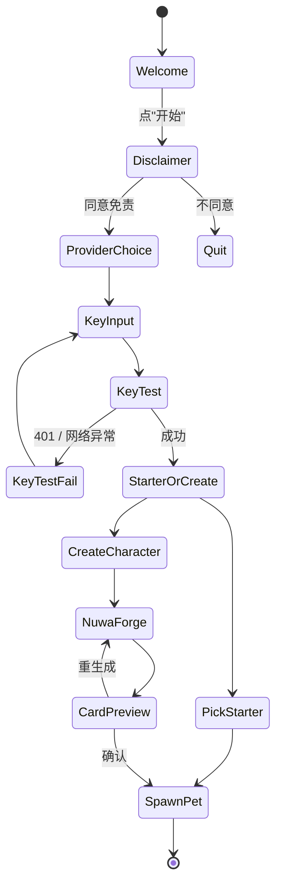
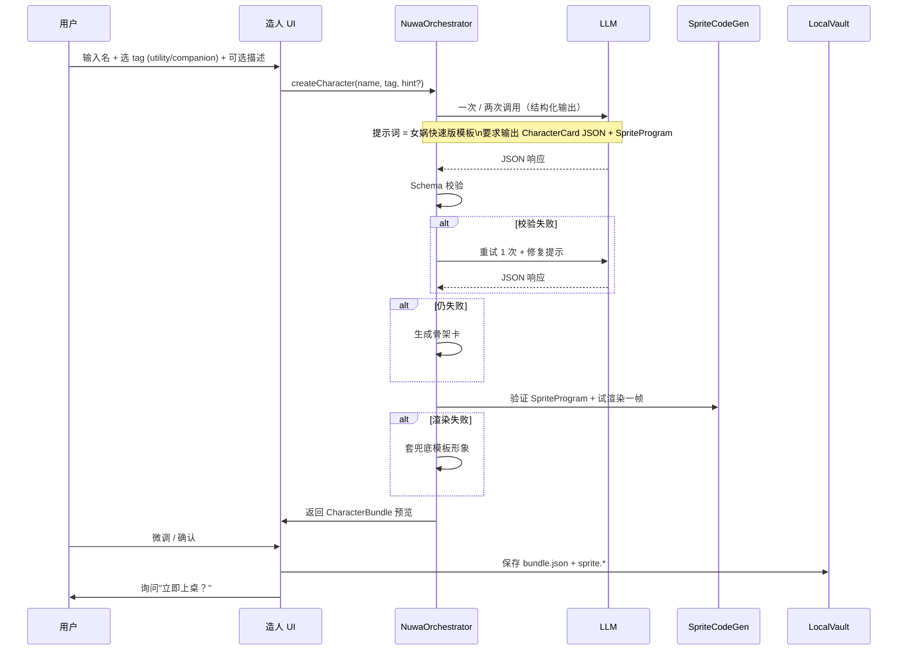
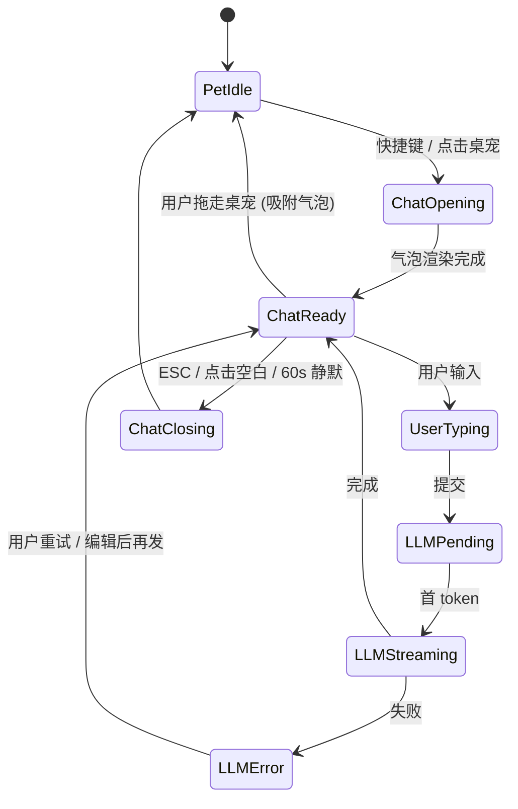
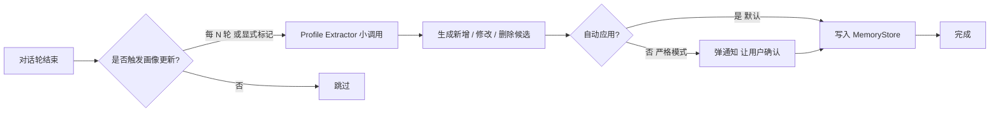
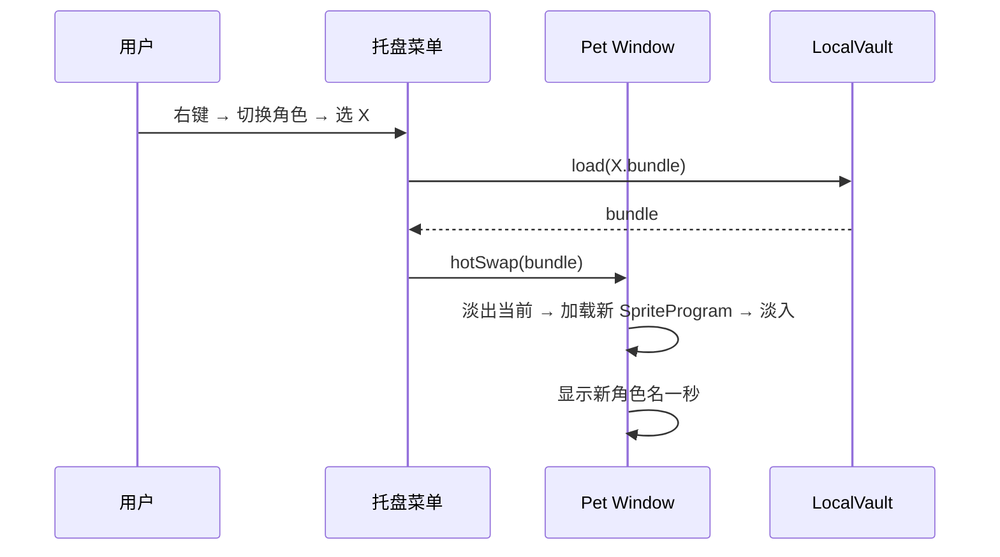
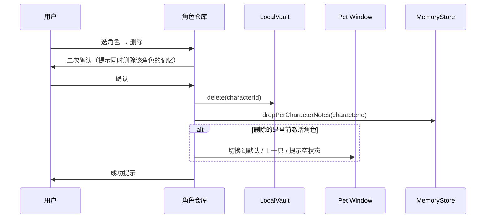

# 百灵 Bailin · MVP 关键流程详图（MVP-FLOWS v0.1）

> 配套：[PRD.md](PRD.md) §7 / [CHARACTER-PROTOCOL.md](CHARACTER-PROTOCOL.md)
> 目的：把 PRD 的 5 条高层流程展开成可对照实现的状态、分支和错误恢复

---

## 0. 流程索引

| 流程 | 入口 | 关键产出 |
| --- | --- | --- |
| 1 首次启动 | 双击应用 | 桌宠出现 + 第一次对话准备好 |
| 2 角色创建（造人） | 设置 / 首启向导 → "造一个角色" | CharacterBundle 入库 |
| 3 唤起聊天 | 快捷键 / 点击桌宠 | 一轮 / 多轮 LLM 对话完成 |
| 4 记忆管理 | 设置 → "角色与记忆" | UserProfile 被查看 / 编辑 / 清空 |
| 5 切换 / 删除角色 | 托盘菜单 / 角色仓库 | 当前激活角色变更或角色卡被删除 |
| 6 错误恢复 | 任意上一条流程内的失败分支 | 用户拿到清晰下一步 |

---

## 1. 首次启动流程

### 1.1 状态图



### 1.2 关键约束

- **Disclaimer**：一屏可读完；强调"不替代真人 / 受启发 / 非授权"；不同意则退出应用
- **ProviderChoice**：默认列出 2-3 个最常见提供商（OpenAI 兼容 / Anthropic 兼容 / 自定义 BaseURL），不强制注册账号
- **KeyTest**：发一个最便宜的请求（如 chat completions 一个 system + "ping" user 消息，max_tokens=4），1.5 秒内返回算通过
- **StarterOrCreate**：双卡片选择页，"挑一只示例角色"放在左侧（默认聚焦），"从头造一只"放在右侧
- **SpawnPet**：桌宠首次出现要有"破壳"动画（一个简单的缩放 + 透明度淡入即可，约 800ms）

### 1.3 计时与离开

- 整段流程目标 **3 分钟内完成**
- 用户中途关闭应用 → 已配置的部分保留（不丢 Key）
- 下次启动若 KeyTest 仍可用 → 跳过整段，直接进 SpawnPet

### 1.4 性能 & 体验细节

- 启动到 Welcome 出现 ≤ 2 秒
- 所有按钮 hover / press 状态用 60fps 反馈
- 全程不打开浏览器；不要求用户在外部完成任何操作

---

## 2. 角色创建（造人）流程

### 2.1 完整时序



### 2.2 时长目标

| 阶段 | 目标时长 |
| --- | --- |
| 提示词构造 + 单次 LLM 调用 | 30~60 秒（取决于模型） |
| Schema 校验 + 重试 | < 1 秒（不含网络） |
| Sprite 试渲染一帧 | < 200ms |
| 整体造人 | **≤ 120 秒**（用户感知"等待是值得的"上限） |

> 超过 120 秒：界面切换为"还在打磨..."安抚 + 给"取消并用骨架卡"按钮

### 2.3 进度可视化

- 三段进度：**调研 → 提炼 → 形象生成**
- 每段都有"友好旁白"，避免空进度条
- 实用线和情感线使用不同色调的旁白文案，强化角色定位

### 2.4 角色卡预览页

- 顶部：角色名 + 标签 + 一句话引言 + 像素桌宠预览（活的，可点击试反应）
- 中部：心智模型 N 个（卡片列表，可折叠展开）
- 底部：表达 DNA 摘要、价值观追求/拒绝、骨架卡警告（如有）
- 操作：**确认 / 改名 / 重新生成形象 / 重新生成人格 / 取消**
- "重新生成形象"只重跑 SpriteCodeGen，不重跑人格
- "重新生成人格"会清空当前 card 并重跑

### 2.5 失败分支总结

| 失败点 | 现象 | 兜底 |
| --- | --- | --- |
| LLM 请求失败 | 网络 / 401 / 5xx | 提示并允许"重试 / 取消" |
| JSON 格式错 | 不符合 Schema | 重试 1 次 → 仍失败用骨架卡 |
| 心智模型 < 2 个 | 信息源不足 | 骨架卡 + isHighInformationRichness=false |
| Sprite 解析失败 | DSL 非法 | 套兜底模板 + 重新生成形象按钮 |
| Sprite 渲染崩溃 | Worker 异常 | 同上 |
| 用户主动取消 | 任意阶段 | 不入库；下次重新开始 |

### 2.6 信息源策略（MVP）

- 默认仅依赖 LLM 训练知识 + 用户可选粘贴的一段补充文本（≤ 2000 字）
- 不联网搜索；不调用 WebSearch
- 用户输入"粘贴补充素材"开关 → 把素材作为 system 消息传入造人 prompt
- v1.0 才考虑：若用户的 LLM 提供商支持工具调用，开启联网模式（类似原女娲流程）

---

## 3. 唤起聊天流程

### 3.1 状态图



### 3.2 唤起的视觉要点

- 气泡从桌宠头顶 / 旁边"长出来"（200ms 动画）
- 气泡有指向桌宠的小尾巴
- 桌宠状态切到 `talk`，张嘴 / 头部轻微动
- 输入框默认聚焦
- 输入框上方有 1 行"建议提问"（基于角色 DNA 生成的 3 个示例，可点击直接发送）

### 3.3 多轮对话上下文

- 同一次 ChatReady → ChatClosing 之间属于同一会话
- ChatClosing 后再次唤起：默认继续上一会话上下文（保留 12 轮）
- 用户可点击"新对话"按钮显式开启新会话
- 跨设备 / 跨角色：会话不共享

### 3.4 流式输出与中断

- 默认流式
- 用户在 LLMStreaming 期间再次提交 → 中断当前流，保留已生成的部分作为 assistant 消息（标记"被打断"）
- ESC 关闭气泡 → 不取消请求（让它在后台跑完，下次唤起时显示"上次还没看完"）

### 3.5 错误回退

| 错误 | 角色化处理 |
| --- | --- |
| 网络错误 | "我这边信号不好，待会再问我？" + 重试按钮 |
| 401 | 跳到设置页 Key 输入 + 提示"换张通行证" |
| 限流 | "对方让我等等，我们半分钟后继续？" |
| 拒答（SafetyPolicy 命中） | 角色化拒答模板（保留人格） |
| LLM 输出空 | 自动重试 1 次；仍空显示"我走神了，再说一次？" |

### 3.6 退出角色

- 用户输入 `roleplay.exitTriggers` 中的任一关键词
- 立刻切到"通用模式"：下一条回复不再用角色 system prompt，标识"已退出角色"
- 用户输入"切回角色"则恢复
- 气泡 UI 在通用模式有不同色调标记，防止混淆

### 3.7 性能指标

- 唤起到气泡出现：≤ 150ms
- 提交到首 token：取决于 LLM 提供商；UI 在 500ms 内必须显示"正在思考"动画
- 气泡渲染：60fps；长回复不卡

---

## 4. 记忆管理流程

### 4.1 信息架构

- 设置 → "角色与记忆" → 左侧角色列表 / 右侧详情
- 详情 tab：**对话偏好 / 用户画像 / 角色对我的备注**
- 全局区："清空所有数据"

### 4.2 用户画像视图

- 字段分组：基础（称呼）/ 目标（多条）/ 烦恼（多条）/ 禁忌（多条）
- 每条记忆显示：内容、最后更新时间、来自哪段对话（可选脱敏摘要）
- 操作：编辑（内联）/ 删除（带二次确认）/ 添加（手动）

### 4.3 更新时机



### 4.4 用户控制度

- 默认：自动应用，但所有改动都可在记忆页面追溯（"最近变更"列表）
- 严格模式（v1.0）：每次更新需要用户点 OK
- "撤回最近一次更新" 始终可用（10 分钟内）

### 4.5 一键清空

- 三个级别：
  1. 清空当前角色对我的备注
  2. 清空全部用户画像
  3. 清空所有数据（角色 + 画像 + 设置，但保留 Key 或同步清除可选）
- 每级独立二次确认 + 输入"DELETE"字样防误操作
- 清空后不可恢复（明确提示）

---

## 5. 切换 / 删除角色流程

### 5.1 切换激活角色



- 切换过程不打断当前对话 → MVP 决策：**关闭当前对话气泡，提示"已切换角色"**
- 切换不丢失旧角色的会话上下文（再切回去时继续）

### 5.2 删除角色



- 不存在"回收站"，删除即不可恢复
- 用户可在删除前导出（v1.x 才有导出）

---

## 6. 错误恢复与降级矩阵

| 场景 | 表现 | 兜底 | 用户下一步 |
| --- | --- | --- | --- |
| 启动时 Key 失效 | KeyTest 401 | 弹设置页 + 提示 | 重新输入 Key |
| 启动时本地数据库损坏 | SQLite 报错 | 弹"修复或重置"对话框 | 选"重置"创建新库（不删除 sprite 文件） |
| 造人 LLM 不可用 | 网络 / 5xx | 不创建 + 提示 | 重试 / 取消 |
| 造人 JSON 不合法 | Schema 拒绝 | 自动重试 1 次 → 骨架卡 | 接受骨架卡 / 重造 |
| 形象渲染崩溃 | Worker 异常 | 套兜底模板形象 | 重新生成形象 |
| 形象高 CPU 占用 | 持续超 16ms/帧 | 自动降到 15fps + 通知 | 一键"换形象" |
| 桌宠卡住不动 | 状态机异常 | 看门狗 5 秒重置到 idle | 无感知 |
| 对话中断 | 网络异常 | 保留已生成部分 + 角色化道歉 | 重试 |
| 退出后再启动找不到上次角色 | 文件丢失 | 默认上桌"上一只可用角色" | 角色仓库选择 |
| 用户磁盘满 | 写入失败 | 弹通知 + 暂停所有写操作 | 用户清空后恢复 |

---

## 7. 关键 UI 草图（文字版）

> 真实 UI 设计稿在路线图后期产出；这里给"必须包含的元素"清单。

### 7.1 首启 - ProviderChoice

```
┌─────────────────────────────────────┐
│  选择你想接入的模型服务              │
│                                     │
│  [ OpenAI 兼容 ]   [ Anthropic 兼容 ]│
│  [ 自定义 BaseURL ]                 │
│                                     │
│  ─ 我们不会上传你的数据 ─           │
└─────────────────────────────────────┘
```

### 7.2 造人预览页

```
┌─────────────────────────────────────────────┐
│  费曼小桌伴            [实用线] [非本人]    │
│  ┌──────┐   "什么都别相信，先弄明白。"      │
│  │像素图│                                   │
│  │ 活的 │   核心心智模型                    │
│  └──────┘   - 命名不等于理解                 │
│  [▶ 试反应] - 拆开看                         │
│             - 教学是检验理解                 │
│                                             │
│  表达 DNA：短句 / 顽皮 / 类比 / 谨慎        │
│                                             │
│  [改名] [重生成形象] [重生成人格]          │
│                                             │
│             [取消]   [确认并上桌] ←默认聚焦│
└─────────────────────────────────────────────┘
```

### 7.3 唤起对话气泡

```
桌宠位置 →    ◯
              ╲
            ┌────────────────────────────┐
            │ 你想跟我聊什么？           │
            │  · 推荐：怎么判断 AI 的炒作│
            │  · 推荐：怎么真的学懂一个东西│
            │  · 推荐：现在卡在哪儿了？   │
            │                            │
            │ [输入...                ▶] │
            └────────────────────────────┘
```

### 7.4 角色仓库

```
┌──────────────┬─────────────────────────┐
│ ☆ 我的角色   │ 费曼小桌伴               │
│              │ 实用 / 公众人物启发      │
│ [当前] 费曼  │ 创建于 2026-06-14        │
│        芒格  │ ─────────────────────    │
│        绫波丽│ [上桌] [切换] [编辑]     │
│              │ [导出 v1.x] [删除]       │
│ [+ 造一个]   │                          │
│              │ 该角色对我的记忆 → 3 条  │
└──────────────┴─────────────────────────┘
```

---

## 8. 行为日志与隐私边界

### 8.1 本地日志

- 默认开启：错误日志 + 性能日志（无对话内容）
- 默认关闭：完整对话日志（用户显式开启才记录）
- 设置页可一键查看日志位置 + 导出 + 清空

### 8.2 不上报

- MVP 不向任何远端服务器上报数据
- 若 v1.0 引入崩溃上报，必须显式 opt-in + 文档说明上传字段

---

> 本流程文档与 [PRD.md](PRD.md) 配套：PRD 定"做什么"，本文档定"怎么走"。
> 任何流程修改必须更新对应状态图与错误恢复矩阵。
