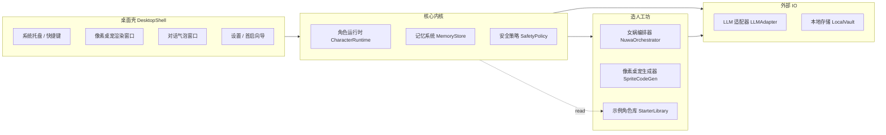

# 百灵 Bailin · 产品需求文档（PRD v0.1）

> 产品名称：**百灵 Bailin**
> 文档状态：v0.1 草案（待评审）
> 关联 Skill：[女娲 · Skill 造人术](../../.agents/skills/huashu-nuwa/SKILL.md)
> 适用阶段：MVP 范围定义 + 长期路线图骨架

---

## 0. 文档结构索引

| 章节 | 内容 |
| --- | --- |
| 1 产品概述 | 一句话定义、问题与机会、产品愿景 |
| 2 目标用户与价值主张 | 双主战场用户画像、典型场景、价值差异 |
| 3 产品定位与差异化 | 与桌宠、AI 角色、Agent 框架的边界对比 |
| 4 MVP 范围 | In / Out、成功指标、关键假设 |
| 5 用户故事 | 双线（实用 / 二次元）+ 平台基础能力 |
| 6 模块设计 | 6 大子系统、职责、深模块抽象 |
| 7 核心用户流程 | 首启、造人、唤起、记忆、删除 |
| 8 技术路线 | 详见 [TECH-ROUTE.md](TECH-ROUTE.md) |
| 9 角色协议 | 详见 [CHARACTER-PROTOCOL.md](CHARACTER-PROTOCOL.md) |
| 10 关键流程详图 | 详见 [MVP-FLOWS.md](MVP-FLOWS.md) |
| 11 路线图 | 详见 [ROADMAP.md](ROADMAP.md) |
| 12 风险与边界 | 内容、版权、隐私、性能、依赖风险 |
| 13 开放问题 | 待评审决策点 |

---

## 1. 产品概述

### 1.1 一句话定义

**百灵 Bailin 是一个开源的 Windows 桌面「人格容器」：用户输入任意人物或角色名，系统受女娲 Skill 启发，蒸馏出「受其启发」的视角助手，并具象成一只程序化像素桌宠——桌面上的百变魂灵，常驻相伴、随手唤起、可聊天、可被持续重塑。**

### 1.2 问题与机会

| 现状痛点 | 现有方案的不足 | 我们的机会 |
| --- | --- | --- |
| 通用 ChatGPT 回答缺乏鲜明视角，建议像"中位数答案" | 角色扮演 App 多停留在表演层，没有内化思维框架 | 用女娲 Skill 把"心智模型 + 决策启发式 + 表达 DNA"结构化注入 LLM |
| 优质思维顾问不可得，普通人需要"换一种眼睛"看自己的问题 | 现有 AI 助手是悬浮窗或聊天页，缺乏"在场感" | 把角色具象成桌宠，常驻视野，降低召唤成本 |
| 桌宠产品（如 Live2D 老牌方案）观赏多于交互，AI 桌宠又多为玩具型聊天 | 缺一个"既能陪伴又能给真见解"的形态 | 双价值线：实用顾问 + 情绪陪伴，由同一容器承载 |
| 二次元角色 AI 多为同质化 Galgame 风、人格漂移严重 | 缺少"心智骨架"约束，对话越久越像通用 AI | 把女娲提炼出的反模式、价值观、内在张力作为人格约束，对抗漂移 |

### 1.3 产品愿景

> 让任何用户都能在 60 秒内，把一位"思想上的同伴"接到自己的桌面上。
>
> 长期目标：从单一桌宠演化为「人格容器平台」——女娲 Skill 负责造人方法论，百灵 Bailin 负责让人格活在桌面，最终用户能积累一个属于自己的「思维顾问董事会」或「二次元陪伴宇宙」。

---

## 2. 目标用户与价值主张

### 2.1 主战场 A：个人成长 / 决策辅助型用户（实用线）

| 维度 | 描述 |
| --- | --- |
| 画像 | 25-40 岁知识工作者：独立开发者、产品经理、研究员、创业者、内容创作者 |
| 典型场景 | 写文章卡壳、做选择犹豫、复盘项目、面试准备、被新闻刷屏想冷静判断 |
| 当前替代方案 | ChatGPT/Claude 通用对话、看书、找朋友聊、刷推 |
| 痛点 | 通用 AI 立场摇摆、朋友未必懂、读书慢，需要"一个有立场的外部视角" |
| 百灵 Bailin 给到的价值 | 一键召唤芒格 / 费曼 / 张小龙 / 乔布斯等视角，给出带特定心智模型的建议，而不是中庸答案 |
| 成功的样子 | "我现在卡住时第一反应是 Ctrl+Shift+P 喊出芒格" |

### 2.2 主战场 B：二次元 / 情绪陪伴型用户（情感线）

| 维度 | 描述 |
| --- | --- |
| 画像 | 18-30 岁二次元爱好者、轻度孤独感人群、ACG 圈用户、Vtuber 粉丝 |
| 典型场景 | 学习 / 工作时希望"有人陪"、想跟喜欢的角色说话、希望桌面"活着" |
| 当前替代方案 | Live2D 桌宠、CharacterAI、Replika、星野等角色 App |
| 痛点 | 老牌桌宠不会对话；AI 角色 App 没有"在桌面陪着我"的在场感；角色容易跑偏 |
| 百灵 Bailin 给到的价值 | 自己原创/复刻喜欢的角色，桌面常驻 + 能聊 + 人格稳定不漂移 + 可换装可养成（长期） |
| 成功的样子 | "我桌面上养着 3 只角色，每天都会和他们说几句话" |

### 2.3 两条线的协同与分隔

| 项目 | 实用线 | 情感线 |
| --- | --- | --- |
| 角色来源 | 真实公众人物为主 | 二次元 / 虚构角色为主 |
| 身份表达 | "受 XX 启发的视角助手" | "受 XX 启发的灵感角色 / 同人陪伴" |
| 视觉风格 | 偏正经、写实化像素 | 偏可爱、Q 版像素 |
| 主要交互 | 唤起→提问→建议 | 唤起→闲聊 / 撒娇 / 撒野 + 桌面活动 |
| 共享能力 | 同一造人引擎、同一渲染引擎、同一桌面壳、同一记忆系统、同一安全边界 | 同上 |

**关键设计原则**：两条线在底层是**同一产品**，只在角色定位标签、推荐示例、动作风格、文案口径上做区分；不为两条线分裂成两个产品。

---

## 3. 产品定位与差异化

### 3.1 一句话差异化

> "其他 AI 角色 App 让你点开网页才能聊天；其他桌宠让你看着它发呆但不能聊；百灵 Bailin 让一个有真实思维框架的角色，活在你桌面上，随手就能召唤。"

### 3.2 与相邻产品的边界

| 产品类型 | 代表 | 它们做什么 | 百灵 Bailin 不同点 |
| --- | --- | --- | --- |
| 通用 AI 助手 | ChatGPT、Claude Desktop | 单一通用人格 | 多角色 + 视角化 + 桌面在场 |
| AI 角色 App | CharacterAI、星野、Talkie | 角色扮演聊天 | 桌面常驻 + 心智骨架而非台词模仿 + 用户自带 Key |
| 经典桌宠 | Shimeji、桌面萌娘 | 动作展示，无对话 | 程序化生成 + AI 对话 + 角色无限扩展 |
| Agent 框架 | Dify、Coze | 让开发者搭 Agent | 面向 C 端、零代码、桌面化产品形态 |
| 个人 AI 角色构建器 | SillyTavern | 重度玩家 DIY 角色卡 | 一键造人 + 桌宠形态 + 开箱即用 |

### 3.3 不做什么（边界清单）

- 不做"声称是本人 / 官方授权"的角色，统一为"受其启发"。
- 不做色情、政治极端、违法内容的角色与对话。
- 不做服务器托管 LLM，用户自带 API Key；产品不赚 API 差价。
- 不做"全屏接管桌面"的浸入式体验，桌宠默认是配角而非主角。
- 不在 MVP 做养成系统、社交系统、角色市场（放路线图）。

---

## 4. MVP 范围

### 4.1 MVP 一句话定义

> **MVP 的唯一目的：验证"用户能在 5 分钟内创建第一个角色 → 它出现在桌面上 → 用户与它完成第一次有质感的对话"这一闭环能否跑通，并能让用户愿意第二天再次召唤。**

### 4.2 In Scope（MVP 范围内）

#### 4.2.1 角色生成（造人）

- 输入：角色名（必填）+ 可选简短描述 / 风格标签（实用 vs 二次元）
- 调用：本地内置的女娲 Skill 流程的**轻量版**（约 1 分钟产出）
- 输出：结构化角色卡（详见 [CHARACTER-PROTOCOL.md](CHARACTER-PROTOCOL.md)）
- 用户体验：进度条 + 流程可视化（调研→提炼→生成形象→准备就绪）
- 失败处理：超时 / 信息不足时给出"骨架角色 + 邀请补充素材"

#### 4.2.2 像素桌宠形象生成

- 由 LLM 输出**程序化 Canvas 渲染代码**（不是图片）
- 包含：基础站姿、行走、闲置、说话、思考、点击反馈、被拖拽 7 个动作状态
- 调色板由角色性格驱动（如冷峻的角色偏暗冷色，活泼的偏亮暖色）
- 渲染端在沙箱中执行渲染代码生成帧序列

#### 4.2.3 桌面壳与活动行为

- 桌面常驻，置顶但不抢焦
- 自由拖拽位置；记住上次位置
- 闲置时随机小动作：走两步、停顿、伸懒腰、看一眼鼠标
- 不打扰原则：默认不主动弹窗，不出现在全屏窗口上方
- 系统托盘图标：右键菜单（隐藏 / 显示 / 切换角色 / 设置 / 退出）

#### 4.2.4 快速唤起与对话

- 默认快捷键：`Ctrl + Shift + P`（可改）
- 点击桌宠本体也可唤起
- 唤起后弹出附着在桌宠旁的对话气泡 / 卡片
- 对话使用用户配置的 LLM API
- 多角色场景下，唤起的是"当前激活角色"；可在托盘切换

#### 4.2.5 轻量用户画像记忆

- 不保存全部聊天历史
- 自动维护一份用户档案：偏好称呼、当前目标、长期烦恼、禁忌话题
- 用户可随时查看 / 编辑 / 清空这份档案
- 记忆只保存在本地

#### 4.2.6 首启与 API Key 配置

- 首次启动引导：免责声明 → 选择 LLM 提供商 → 粘贴 API Key → 测试连通 → 选示例角色或自己造
- 支持至少 2 个主流提供商（OpenAI 兼容 + Anthropic 兼容），其余通过自定义 BaseURL
- API Key 本地加密存储

#### 4.2.7 内置示例角色库

- 3 个实用线 + 3 个情感线（具体阵容评审时定）
- 用户可一键启用，无需走造人流程
- 每个示例角色都用相同的角色协议序列化，可作为造人结果的参考样例

#### 4.2.8 基础安全与免责

- 首次激活角色时一次性免责声明（与女娲 Skill 行为一致）
- 角色卡上明确标注"非本人 / 非官方 / 非授权"
- 内容安全：拒答清单 + 角色越界时的兜底话术
- 一键清空：所有角色 + 记忆 + Key 一键清除

### 4.3 Out of Scope（MVP 不做）

- 深度造人（30 分钟级深度调研）
- 长期完整聊天记忆 / 关系养成 / 好感度系统
- 主动推送 / 桌面任务感知
- 角色市场 / 社区分享 / 云同步
- 多模态：语音、表情贴图、Live2D 动作
- macOS / Linux / 移动端
- 角色之间的多 Agent 对话

### 4.4 MVP 关键假设

| 假设 | 验证方式 |
| --- | --- |
| 用户愿意自己配 API Key | 首启完成率 > 50% |
| 60 秒造人质量足以让人愿意聊 | 造人后首次对话发起率 > 80% |
| 程序化生成的像素形象可被用户接受 | 首批角色"形象满意"评分 ≥ 6/10 |
| 桌宠常驻不会被嫌烦 | 7 日内未删除率 > 40% |
| 一只桌宠 + 一次对话能产生"哇"时刻 | 用户主动分享 / 截图比例 > 5% |

### 4.5 MVP 成功指标（主指标 / 次指标）

- **北极星**：**角色创建完成率**（从启动应用到完成第一个角色并放上桌面的用户占比）
- 关键次指标：
  - 首次对话发起率（创建后是否真的聊了）
  - 次日召唤率（D1 retention 的桌宠特化版）
  - 角色数 / 用户（衡量"愿意造第二个"）
  - 平均会话时长（≥ 3 轮算一次有效会话）

---

## 5. 用户故事

### 5.1 通用 / 平台基础

1. 作为一名首次用户，我希望在不到 3 分钟里完成 API Key 配置并看到桌宠出现在桌面，这样我能立刻判断这个产品值不值得继续。
2. 作为一名不想付订阅费的用户，我希望使用自己已有的 LLM API Key，这样我能控制成本和数据归属。
3. 作为一名注重隐私的用户，我希望所有角色数据和聊天记忆都默认存在本地，这样我不担心被云端汇总。
4. 作为一名开源用户，我希望能在 GitHub 上看到完整源码并自己构建，这样我可以信任并扩展它。
5. 作为一名 Windows 用户，我希望应用开机自启可选、不卡顿、不影响游戏全屏，这样它不会变成负担。
6. 作为一名重度多任务用户，我希望桌宠不会乱跑到我的代码窗口上，这样它不会干扰我的工作。
7. 作为一名误操作担心者，我希望"一键清除所有数据"始终可达，这样我可以放心试用。

### 5.2 角色创建（造人）

8. 作为一名实用派用户，我希望只输入"芒格"就能拿到一个能跟我聊投资的角色，这样我不需要懂任何 prompt 工程。
9. 作为一名二次元用户，我希望输入"绫波丽"就能拿到一个气质对味的桌宠，这样我能直接拥有自己想要的角色。
10. 作为一名挑剔用户，我希望在造人结果出来后能看到"角色卡预览"，并能微调几个核心字段，这样我不会被一锤子定型。
11. 作为一名担心生成失败的用户，我希望造人过程有清晰进度提示，失败时也能拿到一个"草稿角色 + 重试"，这样我不会卡在中间。
12. 作为一名想造冷门角色的用户，我希望系统在信息不足时诚实告诉我"这个角色资料很少，质量会受限"，这样我有合理预期。
13. 作为一名讲究造型的用户，我希望像素桌宠的颜色 / 配饰能多少反映角色气质，而不是千篇一律的小人，这样我会觉得是"我的"角色。
14. 作为一名手里有素材的用户，我希望能上传一段角色设定 / 一段经典台词 / 一张参考图，让造人结果更贴近我心中的样子（MVP 末期或 v1.1）。

### 5.3 桌面陪伴

15. 作为一名常驻用户，我希望桌宠会自己走两步、发个呆，让我感觉它"活着"，而不是死站着。
16. 作为一名安静派用户，我希望可以随时让桌宠"安静一会"或"躲到角落"，这样我专注时不被打扰。
17. 作为一名 ACG 用户，我希望可以拖动桌宠改变位置，松手有"啊"的小反应，这样很可爱。
18. 作为一名多角色用户，我希望同时只放一只在桌面，但可以从托盘快速切换，这样我不会乱。
19. 作为一名美观派用户，我希望桌宠在不同壁纸下都还看得清，颜色不会糊掉，这样它能融入我的桌面。
20. 作为一名节能党，我希望桌宠在我离开电脑（屏幕休眠 / 锁屏）时自动停止动画，这样不浪费电。

### 5.4 唤起与聊天

21. 作为一名忙碌用户，我希望按下快捷键就能在桌宠旁边弹出对话框，不用切换窗口，这样我能在思考流里直接提问。
22. 作为一名 PM 用户，我希望角色给我的建议带有它独特的视角，而不是 ChatGPT 风格的中庸总结，这样我才有用它的理由。
23. 作为一名追问用户，我希望同一对话能连续追问，不用每次重新建立上下文，这样讨论可以变深。
24. 作为一名怕长篇的用户，我希望默认回答简短有节奏（符合该角色 DNA），并能"展开详细说"，这样我不被淹没。
25. 作为一名沉浸用户，我希望角色不会在每次对话都念免责声明，这样我不会被打断。
26. 作为一名想退出角色的用户，我希望明确说"退出角色"时它能立刻回到正常 AI 模式回答事实问题，这样我能在两种模式间切换。
27. 作为一名想结束对话的用户，我希望按 ESC 或点击桌面空白就能收起对话气泡，桌宠回到闲置状态，这样我无缝回到工作。
28. 作为一名打字慢的用户，我希望对话框支持多行输入和粘贴长文，这样我能整段抛给它分析。

### 5.5 记忆与个性化

29. 作为一名长期用户，我希望角色能记住我的称呼 / 当前在做的项目 / 不想被提到的话题，这样它不会每次"失忆"。
30. 作为一名注重控制的用户，我希望能看到"角色记住了我什么"，并能编辑 / 删除，这样我不被画像绑架。
31. 作为一名隐私敏感用户，我希望默认不保存完整聊天记录，只保存抽象出来的用户画像，这样泄露风险更小。
32. 作为一名想分人格的用户，我希望每个角色各自维护一份对我的记忆，这样不同角色给的建议不会互相穿插。

### 5.6 角色管理与示例库

33. 作为一名新用户，我希望首启时能直接挑一个内置示例角色（一只乔布斯 / 一只费曼 / 一只虚构 ACG 角色），这样我不用马上造人就能体验产品。
34. 作为一名管理用户，我希望有一个"角色仓库"页面，可以浏览 / 切换 / 删除 / 重新生成我的角色，这样我能整理我的人格收藏。
35. 作为一名复用用户，我希望能把任意角色导出为 JSON / Markdown，方便备份和未来分享（v1.x），这样我的造人不会被锁死。
36. 作为一名重置用户，我希望删除角色时被清楚提醒"将同时删除该角色的所有记忆"，这样不会误操作。

### 5.7 安全 / 合规

37. 作为一名公众人物粉丝，我希望角色卡上始终显示"受 XX 启发，非本人 / 非官方"，这样我清楚边界。
38. 作为一名同人爱好者，我希望系统不要假装是原作者授权，但也不要因此让角色变得无趣，这样我能放心玩。
39. 作为一名遇到敏感问题的用户，我希望角色用它自己的方式拒答（保留个性），而不是冷冰冰的"我不能回答"，这样不会破坏沉浸。
40. 作为一名儿童家庭用户，我希望可以开启"严格模式"，让所有角色更克制（v1.1），这样可以家用。

### 5.8 开发者 / 进阶用户

41. 作为一名开源贡献者，我希望角色卡 / 渲染协议 / 提示词模板都有清晰文档，这样我能扩展新角色和新动作。
42. 作为一名 Skill 玩家，我希望可以把外部已有的 `*-perspective` Skill 文件夹直接导入 百灵 Bailin，这样我多年积累的角色不浪费。
43. 作为一名调试者，我希望能查看"当前发给 LLM 的完整提示词"，这样我能理解为什么角色这么回答。

---

## 6. 模块设计

> 原则：把易变的耦合（UI、模型、平台）和稳定的内核（角色协议、记忆、渲染合约）分开，内核做深模块。

### 6.1 模块全景

### 6.2 模块职责清单

| 模块 | 职责 | 接口稳定性 | 备注 |
| --- | --- | --- | --- |
| **DesktopShell** | 渲染桌宠窗口、对话窗口、托盘、快捷键、首启向导 | 易变（平台细节） | Windows 优先，预留跨平台抽象 |
| **CharacterRuntime**（深模块） | 加载角色卡 → 组装系统提示词 → 调度 LLM → 输出角色化回复 | 稳定 | 核心可单测，UI 不依赖具体 LLM |
| **MemoryStore**（深模块） | 维护"用户画像 + 角色×用户关系"的小型结构化记忆 | 稳定 | MVP 只做画像层；为关系记忆预留接口 |
| **SafetyPolicy** | 拒答清单、敏感话题策略、角色越界兜底 | 稳定 | 与角色无关的全局策略 |
| **NuwaOrchestrator** | 调用 LLM 跑女娲快速流程 → 产出角色卡（含人格 + 形象 + 风格） | 中等（流程会迭代） | 一次性写一段提示词模板组合 |
| **SpriteCodeGen**（深模块） | 让 LLM 输出符合渲染 DSL 的代码 → 校验 → 沙箱渲染 | 稳定（DSL 一旦定下不应改） | DSL 即"渲染合约"，是平台护城河 |
| **StarterLibrary** | 内置示例角色（角色卡 + 渲染代码） | 稳定 | 与造人结果格式一致，可作为回退样板 |
| **LLMAdapter** | OpenAI / Anthropic / 自定义 BaseURL 的统一封装 | 中等 | 关注超时、重试、Key 注入 |
| **LocalVault** | 本地存储角色卡、记忆、Key（加密）、设置 | 稳定 | 文件级 + 简单加密；为云同步预留导出格式 |

### 6.3 哪些模块在 MVP 重点写测试

- `CharacterRuntime`：组装提示词的输出是否稳定（snapshot 测试）
- `MemoryStore`：画像 CRUD + 清空的边界
- `SpriteCodeGen`：DSL 校验器对错误代码能拒绝（防 LLM 乱写）
- `SafetyPolicy`：拒答清单命中
- `LLMAdapter`：超时 / 401 / 限流的错误归一化

UI 层 MVP 不强测，靠人工冒烟。

---

## 7. 核心用户流程（高层）

> 详图见 [MVP-FLOWS.md](MVP-FLOWS.md)。这里给纲领。

### 7.1 首次启动

1. 启动应用 → 欢迎页 + 一段免责声明
2. 选择 LLM 提供商 → 输入 / 粘贴 API Key（可选自定义 BaseURL）→ 点"测试连通"
3. 二选一：
   - 选择一个示例角色（推荐路径，最快出现桌宠）
   - 直接进入"造一个角色"

### 7.2 创建角色（造人）

1. 输入角色名 + 选 tag：实用 / 二次元
2. 系统调用女娲快速流程：调研 → 提炼 → 生成形象代码（进度可见）
3. 预览角色卡：核心心智模型、表达 DNA、像素桌宠预览、可微调字段
4. 确认 → 角色保存到本地仓库 → 询问"是否立刻放上桌面"

### 7.3 桌面常驻与唤起

1. 桌宠出现在桌面默认位置（右下角附近避开任务栏）
2. 进入闲置动画循环
3. 用户按快捷键 / 点击桌宠 → 弹出对话气泡
4. 用户输入 → 角色化回复 → 多轮追问
5. ESC / 点击空白 / 等待超时 → 气泡收起，桌宠回到闲置

### 7.4 记忆管理

1. 设置 → "角色与记忆"
2. 选择某个角色 → 查看它对我的画像（结构化展示）
3. 可编辑某条 / 删除某条 / 清空该角色对我的全部记忆
4. 全局"清空所有数据"按钮（带二次确认）

### 7.5 切换 / 删除角色

1. 托盘右键菜单 → "切换角色" → 列表中选一个 → 桌面平滑切换形象
2. 角色仓库页 → 删除某角色 → 确认（提醒会一同删除记忆）

---

## 8. 技术路线（摘要）

> 完整决策与备选见 [TECH-ROUTE.md](TECH-ROUTE.md)

- **桌面壳**：Electron（首选，生态成熟、Web 渲染天然适合 Canvas 桌宠和对话 UI）；Tauri 作为后续优化选项
- **渲染层**：单独的透明、置顶、点击穿透可控的 BrowserWindow，承载 HTML5 Canvas
- **运行时语言**：TypeScript（主进程 + 渲染进程统一）
- **本地存储**：SQLite（角色卡 / 记忆）+ 文件系统（渲染代码）+ DPAPI 加密（API Key）
- **LLM 调用**：主进程内统一 LLMAdapter；HTTP 直连，用户 Key 永不出本机
- **女娲流程**：内置一组提示词模板，对应快速版的 Phase 0~3，跑在用户的 LLM 上
- **桌宠渲染 DSL**：自定义最小 JSON Schema + 受限 JS 子集（详见角色协议文档），由 SpriteCodeGen 产出、客户端在 Web Worker 沙箱中执行
- **安全沙箱**：Web Worker + 不可访问 DOM / 网络 / Node API；只能调用 Canvas API 的白名单子集

---

## 9. 角色与渲染协议（摘要）

> 完整 Schema 和示例见 [CHARACTER-PROTOCOL.md](CHARACTER-PROTOCOL.md)

- 一个角色 = `CharacterCard`（人格）+ `SpriteProgram`（形象）+ `RuntimeConfig`（运行时参数）
- `CharacterCard` 直接复用女娲 SKILL.md 的结构化版本：身份卡、心智模型、决策启发式、表达 DNA、价值观、反模式、诚实边界
- `SpriteProgram` = 调色板 + 部件定义 + 关键帧 + 动作状态机
- 渲染端只负责执行 `SpriteProgram`，不关心是谁画的（人 / LLM / 模板）
- 所有协议字段 JSON 可序列化、可导入导出

---

## 10. 关键流程详图

> 见 [MVP-FLOWS.md](MVP-FLOWS.md)：包含首启、造人、唤起聊天、记忆管理、删除清理、错误恢复 6 条流程。

---

## 11. 路线图（摘要）

> 完整阶段拆解见 [ROADMAP.md](ROADMAP.md)

| 阶段 | 主题 | 关键交付 |
| --- | --- | --- |
| v0.x MVP | 闭环 | 造人 + 桌宠 + 唤起聊天 + 画像记忆 + 示例库 |
| v1.0 | 体验提升 | 深度造人模式、动作丰富、表情系统、严格模式 |
| v1.1 | 多角色协作 | 角色仓库强化、角色之间互不干扰的并行存在 |
| v1.2 | 关系养成 | 好感度、长期关系记忆、关系事件回顾 |
| v1.3 | 主动陪伴 | 工作感知 + 主动建议（可关闭）、专注模式 |
| v2.0 | 平台化 | 角色市场 / 导入导出标准 / 社区分享 |
| v2.x | 多模态 | 语音、情绪贴图、Live2D 风格扩展 |
| v3.0 | 跨端 | macOS / Linux，可能移动端常驻通知形态 |

---

## 12. 风险与边界

### 12.1 内容与版权

- 风险：复刻真人 / 知名 IP 角色可能引发肖像 / 版权 / 商标争议
- 缓解：
  - 全局"受其启发，非本人 / 非官方 / 非授权"硬标识
  - 不模仿外貌过于精确（像素风天然抽象有保护作用）
  - 设置敏感人物名单（如未成年、近期处于法律事件中的人）需要二次确认或拒绝
  - 商业化路径上避开"卖角色"

### 12.2 隐私

- 风险：用户 API Key 泄露 / 聊天记录泄露
- 缓解：Key 使用系统 DPAPI 加密；默认不保存完整聊天；记忆只保存抽象画像；提供一键清空

### 12.3 模型 / 成本

- 风险：用户用低端 / 免费层模型 → 角色质量差、形象生成失败
- 缓解：在 UI 中清晰说明"模型能力影响体验"，并对生成步骤给出推荐模型档位

### 12.4 渲染安全

- 风险：LLM 输出的渲染代码恶意 / 死循环 / 高 CPU
- 缓解：DSL 子集 + Web Worker 沙箱 + 执行时长上限 + 黑名单 API + 渲染代码二次审查（语法 + 结构校验）

### 12.5 性能 / 资源

- 风险：常驻应用吃内存 / 电池
- 缓解：闲置时降低帧率、屏幕休眠时暂停、可一键"打瞌睡"

### 12.6 依赖

- 风险：女娲 Skill 自身演进会引入新 Phase / 字段
- 缓解：内嵌"产品化快速版"提示词，与女娲主仓库松耦合，靠协议层适配新字段

---

## 13. 已敲定的产品决策（由 v0.1 评审定）

> 以下 7 个原本是开放问题，2026-06-14 评审后定稿。落到 MVP 实现。

1. **桌宠默认气质 = 完全跟随角色**：首启不做用户偏好问卷；任何"性格倾向"参数由该角色卡的 `expressionDNA / values` 自动驱动。
2. **API Key 配置 = 全局一份**：MVP 不支持"按角色用不同模型"，简化首启与设置；v1.x 路线图再评估"按角色重写 LLM 参数"。
3. **内置示例角色阵容（6 个，**[StarterLibrary](../../packages/starter-library)** 唯一源）**：
   - 实用线：Elon Musk、Donald Trump、张雪峰、MrBeast
   - 情感线：Eren Yeager（艾伦·耶格尔）、Kobe Bryant（科比·布莱恩特）
   - 全部以"受其启发的视角助手"形态呈现，强制免责。
4. **像素桌宠形象 = 完全由 AI 生成，不请插画师**：第一版完全交给 LLM 产出 `SpriteProgram`；不合适用户在 UI 里"重新生成形象"或微调。
5. **MVP 提供调试面板**：在设置 → "高级" 中开启 → 可看到当前发给 LLM 的完整 prompt、上次 LLM 原始 JSON、SpriteProgram 源码、最近一次 SafetyPolicy 命中记录。
6. **首次破壳动画 = 做**：每只角色首次落桌时播一段 800ms 内的"苏醒"动画（透明度淡入 + 轻微缩放抖动），强化情感线用户的仪式感。同一角色不再重复。
7. **对话形态 = 贴着桌宠的气泡**：始终把对话窗口锚定在桌宠周围（智能避免出屏 / 任务栏遮挡），加强"在场感"；不做屏幕中央卡片形态。

### 13bis. 由 §13.3 衍生的硬性规则（实现侧必须遵守）

- **AI 生成形象时必须显式让模型先检索该角色的典型外貌特征**：
  - 真人角色：发型、肤色、典型穿着、最具辨识度的装饰（如特朗普的领带 + 发型、马斯克的黑色 T 恤、科比的紫金色球衣 + 24 号、张雪峰的眼镜 + 黑色西装等）
  - 虚构角色：原作设定的发色、眼色、典型服装、能力相关视觉符号（如艾伦的 104 期调查兵团制服 + 围巾、立体机动装置）
  - 检索方式：优先调用模型自带的网络搜索 / 工具；不可用时基于训练知识 + 用户提示 / 用户上传文本；外貌摘要写入 `meta.avatarHint` 与 `SpriteProgram.palette / parts`
  - 调色板必须从角色已知主色推导，不能默认套通用配色
- **像素形象与人格一致性 = 必须互相约束**：调色板冷色 → 表达 DNA 中"短句 / 冷静 / 确定"；冷酷武装角色 → 不会出现兔耳朵这种破坏识别的配饰
- 实现入口见 `packages/nuwa-prompts/src/templates/appearance-research.ts`

---

## 附录 A：文档矩阵

| 文档 | 路径 | 作用 |
| --- | --- | --- |
| PRD（本文） | `docs/product/PRD.md` | 总览：定位 / 用户 / MVP / 模块 |
| 技术路线 | `docs/product/TECH-ROUTE.md` | 平台 / 桌面壳 / 运行时 / 渲染 / Key 管理 |
| 角色协议 | `docs/product/CHARACTER-PROTOCOL.md` | 角色卡 / 桌宠 DSL / 提示词组装 |
| MVP 流程 | `docs/product/MVP-FLOWS.md` | 关键流程详图与状态转移 |
| 路线图 | `docs/product/ROADMAP.md` | 阶段性版本规划 |

## 附录 B：术语表

| 术语 | 含义 |
| --- | --- |
| 造人 | 触发女娲流程生成一个新角色的动作 |
| 角色卡（CharacterCard） | 一个角色的结构化人格定义，JSON 化的 SKILL.md |
| 桌宠程序（SpriteProgram） | 一个角色的程序化形象定义，渲染端按它绘制 |
| 唤起 | 通过快捷键 / 点击让对话气泡出现的动作 |
| 召唤 | 把一个角色放到桌面成为当前激活角色的动作 |
| 视角助手 | 我们对"受 XX 启发的人格"的统一称谓 |
| 用户画像（UserProfile） | 角色对我的轻量记忆：称呼、目标、烦恼、禁忌 |

---

> 文档维护：本 PRD 与 4 份子文档构成完整产品规格；后续如有重大方向调整，先改 PRD，再向下同步。
