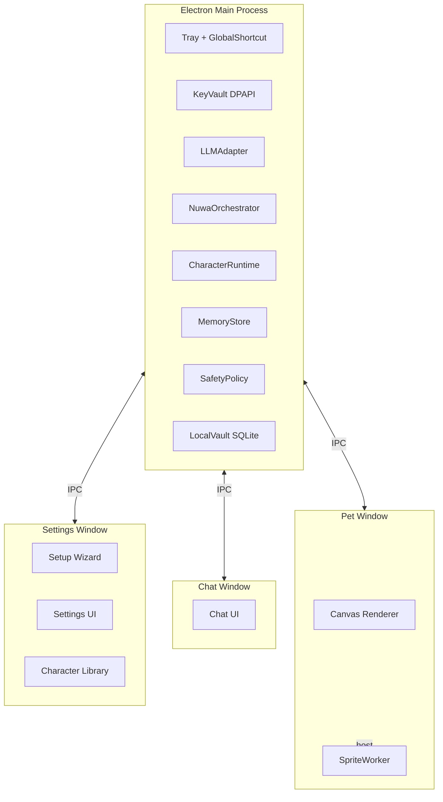

# 百灵 Bailin · 技术路线（TECH-ROUTE v0.1）

> 配套：[PRD.md](PRD.md) §8
> 目的：把 PRD 中的"Windows 桌面端 + 程序化像素桌宠 + 自带 API Key + 开源"翻译成可落地的技术选型与边界

---

## 1. 选型原则

1. **Windows 优先，跨端可演进**：MVP 只发 Windows，但所有技术选型必须能在 12 个月内迁到 macOS / Linux 不重写内核
2. **内核与外壳分离**：CharacterRuntime / MemoryStore / SpriteCodeGen / SafetyPolicy 必须不依赖 Electron / Tauri / Win32 API
3. **零云服务前提**：所有功能在"只有用户本机 + 用户的 LLM API"前提下必须能跑
4. **沙箱大于自由**：LLM 输出的渲染代码进入用户机器执行，安全边界必须显式且窄
5. **开源用户友好**：编译、依赖、目录结构要让一个新贡献者 30 分钟内能跑起来

---

## 2. 桌面壳选型

### 2.1 候选对比

| 维度 | Electron | Tauri | WPF / WinUI | Qt + QML |
| --- | --- | --- | --- | --- |
| Canvas 渲染能力 | 强（Chromium） | 强（系统 WebView） | 中等（D2D / Composition） | 强 |
| 透明窗口 + 置顶 + 鼠标穿透 | 成熟 | 可用但坑略多 | 原生最强 | 成熟 |
| 跨端迁移 | 一次到位 | 一次到位 | Windows-only | 跨端 |
| 包体积 | 大（~80MB+） | 极小（~5MB） | 中等 | 中等 |
| LLM 生态 / 提示词工程 | TS 生态最全 | 一般 | 较弱 | 较弱 |
| 学习曲线 | 低 | 中 | 中（C# / XAML） | 中（QML） |
| 与 Web 渲染 DSL 的契合度 | 极高（Canvas 即原生） | 高 | 低 | 中 |

### 2.2 决策

- **MVP 选 Electron**
  - 理由：Web Canvas 是我们桌宠渲染的天然战场；LLM 编排 + 提示词模板用 TS 最顺；透明窗口 / 托盘 / 全局快捷键的 Electron 生态文档充足
  - 妥协：包体积大；后续可选迁 Tauri 优化（用同一份 TS 渲染层 + 内核）
- **v2.x 评估 Tauri 迁移**：当 CharacterRuntime / SpriteCodeGen 稳定后，把 Rust 主进程承担桌面壳，Web 端只做渲染

---

## 3. 进程与窗口架构



### 3.1 窗口职责

| 窗口 | 形态 | 特性 | 备注 |
| --- | --- | --- | --- |
| **Pet Window** | 透明 / 无边框 / 置顶 / 可拖拽 | 仅在桌宠像素范围内可点击，其他区域鼠标穿透 | 唯一常驻窗口；尺寸 ≤ 200×200 |
| **Chat Window** | 半透明 / 圆角 / 跟随桌宠 | 唤起时创建，关闭时销毁；可吸附在桌宠四周 | 不抢焦的轻浮窗，按 ESC 关闭 |
| **Settings Window** | 普通窗口 | 首启向导、API Key、角色仓库、记忆管理 | 常规 SPA，关闭不影响桌宠 |

### 3.2 多角色处理

- MVP：同一时刻桌面只有一只桌宠（一个 Pet Window）
- 切换角色：销毁旧 Pet Window 的 SpriteWorker → 加载新 SpriteProgram → 同一窗口重渲染（不闪烁）
- v1.1 以后：考虑允许多只 Pet Window 并存

### 3.3 鼠标穿透策略（关键技术点）

- Electron 提供 `setIgnoreMouseEvents(true, { forward: true })`
- 渲染端按帧实时回报"鼠标当前帧的像素是否在桌宠 alpha > 0 区域"
- 在桌宠像素上 → 关闭穿透，可点击 / 拖拽；在透明区 → 开启穿透
- 性能：每 50ms 检测一次足够，节流避免帧率影响

---

## 4. LLM 调用层

### 4.1 LLMAdapter 接口

```ts
interface LLMRequest {
  characterId: string;
  systemPrompt: string;
  messages: Array<{ role: 'user' | 'assistant'; content: string }>;
  config: {
    provider: 'openai-compatible' | 'anthropic-compatible' | 'custom';
    baseUrl: string;
    apiKey: string;
    model: string;
    temperature?: number;
    maxTokens?: number;
  };
  stream: boolean;
}

interface LLMResponse {
  contentStream: AsyncIterable<string>; // 或 string（非 stream）
  finishReason: 'stop' | 'length' | 'safety' | 'error';
  usage?: { promptTokens: number; completionTokens: number };
}
```

### 4.2 支持的提供商（MVP）

| 提供商类型 | 适配方式 | 备注 |
| --- | --- | --- |
| OpenAI 兼容 | `/v1/chat/completions` 标准 | 覆盖 OpenAI 官方、DeepSeek、Moonshot、Together、SiliconFlow 等 |
| Anthropic 兼容 | `/v1/messages` 标准 | Claude 官方 + 国内代理 |
| 自定义 BaseURL | 沿用 OpenAI 兼容协议 + 用户填 BaseURL | 兜底，覆盖一切 OpenAI 协议代理 |

不在 MVP 适配：Gemini 原生协议（OpenAI 兼容代理大量存在，先不直连）

### 4.3 错误归一化

| 来源错误 | 归一化分类 | 用户提示 |
| --- | --- | --- |
| 401 / 403 | `AUTH_FAILED` | "API Key 无效，请到设置中重新填写" |
| 429 | `RATE_LIMITED` | "对方限流了，稍等几秒再问我" |
| 5xx | `PROVIDER_ERROR` | "对方服务出问题了，待会再聊？" |
| 网络异常 | `NETWORK_ERROR` | "连不上对方服务，检查一下网络？" |
| 超时 | `TIMEOUT` | "对方有点慢，要不再问一次？" |
| 内容拦截 | `CONTENT_FILTER` | 走 SafetyPolicy 的兜底话术 |

### 4.4 流式与中断

- MVP 默认开启流式输出（chat 体验关键）
- 用户在回答未完成时再次提交 → 中断当前流，开新一轮（保留前一轮的部分内容到上下文）

### 4.5 Key 安全

- 主进程 `KeyVault`：Windows 用 **DPAPI（CryptProtectData）** 加密，密文落 SQLite
- 渲染进程**永不**接触明文 Key；所有调用经 IPC 走主进程
- 设置页"显示 Key"按钮：每次显示前要求用户重新输入应用密码（v1.0 引入）

---

## 5. 本地存储

### 5.1 数据分层

| 数据 | 存储介质 | 加密 |
| --- | --- | --- |
| API Key | SQLite（DPAPI 密文） | 是 |
| 角色卡（CharacterCard） | SQLite 行 + JSON 字段 | 否 |
| 桌宠程序（SpriteProgram） | 文件系统（每角色一个 `.sprite.json` + 可选 `.sprite.js`） | 否 |
| 用户画像（UserProfile） | SQLite 行 | 否 |
| 会话上下文（短期） | 内存 + SQLite WAL（崩溃恢复） | 否 |
| 完整聊天历史 | **默认不存**；用户显式开启后存 SQLite | 开启即加密 |
| 应用设置 | JSON 文件 | 否 |
| 渲染缓存（帧序列） | 临时文件 | 否 |

### 5.2 目录布局（用户机）

```
%APPDATA%/Bailin/
├── vault.db              # 角色卡、画像、Key、设置
├── characters/
│   ├── <characterId>/
│   │   ├── card.json     # 冗余备份
│   │   ├── sprite.json   # 渲染 DSL
│   │   └── sprite.js     # 受限 JS 子集（可选）
├── cache/
│   └── frames/...
└── logs/
    └── app.log
```

### 5.3 导入 / 导出（v1.x）

- 单角色导出包：`<character>.bailin`（zip：card.json + sprite.json + sprite.js + 截图）
- 导入时强制重新校验 sprite 的 DSL 合法性
- 不导出用户画像（隐私）

---

## 6. 桌宠渲染管线

### 6.1 渲染时序

```
SpriteProgram (JSON + 可选 JS)
   ↓ 校验（Schema + AST 白名单）
   ↓
SpriteWorker (Web Worker, 沙箱)
   ↓ 状态机：idle / walk / talk / think / drag / click
   ↓ 每帧产出 ImageBitmap（OffscreenCanvas）
   ↓ postMessage
   ↓
Pet Window 主线程 → drawImage 到 Canvas
```

### 6.2 沙箱约束

| 项 | MVP 策略 |
| --- | --- |
| 执行环境 | Web Worker（无 DOM、无 Node、无 fetch、无 IndexedDB） |
| 可用 API | OffscreenCanvas 2D 子集（drawRect、arc、path、fillStyle、stroke、save/restore、translate、rotate、scale、imageData） |
| 黑名单 | `eval`、`Function`、`importScripts`、`XMLHttpRequest`、`fetch`、`SharedArrayBuffer`、`WebAssembly` |
| 资源上限 | CPU 帧上限 16ms；连续 3 帧超时降帧到 15fps；超 1 秒卡死则杀 Worker 并显示"装睡"动画 |
| 内存上限 | Worker 堆软限 64MB；超出降级 |
| 输入接口 | 只接受 `{state, tick, mouseInBounds, dragging}`；不能读取系统时间外的任何环境 |

### 6.3 状态机（MVP 7 态）

```mermaid
stateDiagram-v2
  [*] --> idle
  idle --> walk: random tick
  walk --> idle: arrival
  idle --> click: user click
  click --> talk: chat opened
  idle --> drag: mousedown hold
  drag --> idle: mouseup
  talk --> idle: chat closed
  idle --> think: long pause in chat
  think --> talk: response streaming
```

### 6.4 性能预算

| 场景 | 帧率 | CPU（单核） | 内存 |
| --- | --- | --- | --- |
| 闲置 | 15fps | < 3% | < 80MB |
| 走动 / 说话 | 30fps | < 8% | < 100MB |
| 屏幕休眠 | 0fps（暂停） | 0% | 维持 |

---

## 7. 女娲流程的"产品化快速版"

### 7.1 与原 SKILL 的差异

| 项 | 原女娲 Skill | 产品化快速版 |
| --- | --- | --- |
| 调度方式 | 多 subagent 并行 + 用户检查点 | 单次 / 双次 LLM 调用（不开 subagent） |
| 时长 | 30 分钟 ~ 数小时 | 60 秒 ~ 120 秒 |
| 输出 | SKILL.md + research/ 目录 | 一个 `CharacterCard` JSON + 一个 `SpriteProgram` |
| 信息源 | WebSearch + 本地素材 | **MVP 只用 LLM 训练知识 + 用户可选 1-2 段补充文本**；不主动联网搜索 |
| 检查点 | Phase 1.5 / 2.5 / 4 | 一个统一的"角色卡预览"检查点 |
| 心智模型数 | 3-7 | 3-5（取最强） |

> 这是**有意识的降级**：换"60 秒可用"。深度版（v1.0）会引入"用户的 LLM 是否支持联网"判断，从而走更接近原 Skill 的流程。

### 7.2 调用形态

- 一次 system+user 调用，要求 LLM 输出严格 JSON（用 JSON Schema 校验 / 函数调用）
- 若用户的模型支持 `response_format=json_schema`，启用；否则用提示词约束 + 二次校验
- 失败重试 1 次；二次失败 → 给一个"骨架角色"+ 邀请用户补充

### 7.3 形象生成时机

- 同一轮造人调用 LLM 时，**让它额外输出 `SpriteProgram`**（同一 JSON 的子字段）
- 形象生成失败 → 退回"基于角色 tag 的模板调色板"
- 不在 MVP 做"基于参考图反推 sprite"

---

## 8. CharacterRuntime 的提示词组装

### 8.1 组装顺序（每轮对话）

1. 顶层身份头：`你是 <角色名>，受公开资料启发的视角助手；非本人 / 非官方 / 非授权。`
2. 角色卡：身份卡 + 核心心智模型（编号 + 一句话）+ 表达 DNA + 反模式
3. 用户画像（如有）：称呼 / 当前目标 / 长期烦恼 / 禁忌
4. 安全策略：拒答清单 + 越界兜底（角色化措辞）
5. 历史消息（短期上下文，按 token 预算裁剪）
6. 用户当前输入

### 8.2 Token 预算

- 默认每轮 system+context 预算 ≤ 4k token
- 历史消息按"最近 N 轮 + 早期摘要"策略
- 摘要工作在每 N 轮（如 8 轮）触发一次

### 8.3 风格强约束

- 在 system 中显式加入"风格违规清单"，列出 3-5 条该角色绝不会说的话
- 输出后做轻量风格校验（关键词命中报警），不阻断回复，只记录用于后续优化

---

## 9. MemoryStore

### 9.1 画像 Schema

```ts
interface UserProfile {
  // 称呼相关
  preferredName?: string;
  pronouns?: string;
  // 上下文
  currentGoals: Array<{ id: string; text: string; updatedAt: number }>;
  ongoingConcerns: Array<{ id: string; text: string; updatedAt: number }>;
  // 边界
  tabooTopics: string[];
  // 角色特定（每个角色单独维护）
  perCharacterNotes: Record<string, Array<{ id: string; text: string; updatedAt: number }>>;
}
```

### 9.2 更新策略

- 每轮对话后，由"画像更新器"对最新一轮做一次轻量 LLM 调用（小模型 / 同模型），抽取需要新增 / 修改的画像条目
- 用户可在设置页直接编辑 / 删除任意条目
- 一键清空 = 重置整个 `UserProfile`

### 9.3 关系记忆（v1.2 才做）

- 好感度、共同回忆、纪念日等；MVP 不在 Schema 内但预留 `relationship` 字段

---

## 10. SafetyPolicy

### 10.1 拒答清单（MVP 静态）

| 类别 | 例子 | 处理 |
| --- | --- | --- |
| 自残 / 自杀 | 详细自残方法 | 角色化关怀 + 引导真实求助渠道 |
| 违法 | 制毒 / 武器 | 角色化拒绝 + 不展开 |
| 极端政治 | 攻击特定群体 | 角色化拒绝 + 转换话题 |
| 未成年色情 | 任何相关 | 硬拒绝 + 记录 |
| 真人隐私 | 公开人物的私人信息编造 | 拒绝 |

### 10.2 角色化拒答模板

- 不是"我是一个 AI 助手，不能..." 而是基于该角色 DNA 给出符合性格的拒绝
- 由角色卡的 `safetyVoice` 字段（可选）提供语气模板；缺省则用通用克制模板

### 10.3 越界检测

- 检测"用户试图让 AI 扮演本人 / 官方 / 性化未成年 / 越权法律建议"等
- 命中 → 触发兜底，不依赖模型自身价值观

---

## 11. 工程脚手架

### 11.1 仓库结构（建议）

```
bailin/
├── apps/
│   └── desktop/                  # Electron 应用
│       ├── main/                 # 主进程
│       │   ├── ipc/
│       │   ├── adapters/         # LLMAdapter, KeyVault
│       │   ├── runtime/          # CharacterRuntime, MemoryStore
│       │   ├── forge/            # NuwaOrchestrator, SpriteCodeGen
│       │   ├── safety/
│       │   └── store/            # LocalVault, migrations
│       ├── renderer/             # React + Canvas
│       │   ├── pet/              # Pet Window
│       │   ├── chat/             # Chat Window
│       │   └── settings/         # Settings + Setup Wizard
│       └── shared/               # 跨进程类型
├── packages/
│   ├── character-protocol/       # CharacterCard / SpriteProgram 的 Schema + 校验器
│   ├── sprite-runtime/           # Worker 沙箱 + 状态机
│   ├── nuwa-prompts/             # 产品化快速版的提示词模板
│   └── starter-library/          # 内置示例角色
├── docs/
│   └── product/                  # PRD 与子文档
└── README.md
```

### 11.2 关键依赖（建议）

| 用途 | 候选 |
| --- | --- |
| Electron 框架 | `electron` + `electron-builder` |
| UI | React + TypeScript + Vite |
| 状态 | Zustand（简单 store）/ React Query（设置页） |
| SQLite | `better-sqlite3` |
| Schema 校验 | `zod` |
| AST 白名单校验 | `acorn` + `eslint-scope`（自实现遍历） |
| LLM SDK | 不绑定厂商 SDK，直接 fetch（包大小可控 + 协议归一） |
| 日志 | `pino` 或 `electron-log` |
| 测试 | Vitest + Playwright（端到端少量） |

### 11.3 构建与分发

- 单二进制 `.exe` + 安装版 + 便携版
- 代码签名（v1.0 必须）
- 自动更新（v1.0；用 `electron-updater`，更新源可指向 GitHub Releases 或自建）

---

## 12. 跨端预案

- 90% 的核心逻辑放在 `packages/*` 与 `apps/desktop/main`，平台特定代码集中在 `apps/desktop/main/platform/win/`
- KeyVault 抽接口 → Windows DPAPI / macOS Keychain / Linux libsecret
- 鼠标穿透 / 透明窗口 / 全局快捷键 → 抽 `WindowPlatform` 接口
- 桌宠渲染层（Web 技术栈）天然跨端

---

## 13. 不在 MVP 的技术决策

| 项目 | 暂不引入 | 原因 |
| --- | --- | --- |
| 自动更新通道 | 是 | MVP 用 GitHub Release 手动下载即可 |
| 崩溃上报 | 是 | 隐私权衡，v1.0 评估 Sentry 自托管 |
| 多模型并行调用 | 是 | 复杂且体验收益有限 |
| 角色之间多 Agent 协作 | 是 | 路线图 v1.x 探索 |
| 端侧小模型推理 | 是 | 资源占用 vs 效果不划算 |
| 浏览器扩展形态 | 是 | 与桌宠定位冲突 |

---

## 14. 风险与对策

| 风险 | 影响 | 对策 |
| --- | --- | --- |
| 沙箱仍被 LLM 绕开 | 高（安全事故） | DSL 优先于 JS；JS 路径默认关闭，用户显式启用；多层 AST 校验；线上灰度先开 DSL-only |
| Electron 透明窗口在某些显卡驱动下闪烁 | 中 | 提供"经典窗口模式"兜底；详细记录显卡型号 |
| 用户的低端模型造人失败率高 | 中 | 在 UI 中推荐模型档位；强校验输出 JSON；提供"骨架角色 + 邀请补素材" |
| 形象生成审美差异大 | 中 | 调色板模板兜底；提供"重新生成形象"按钮（不重造人格） |
| 内存占用被吐槽 | 中 | 闲置降帧 / 长时间无交互卸载部分缓存 / 退出后再启动恢复角色 |

---

> 本文档与 [CHARACTER-PROTOCOL.md](CHARACTER-PROTOCOL.md) 互为表里：技术路线定"用什么跑"，协议定"跑什么"。
